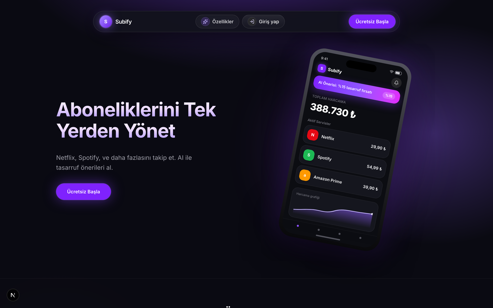
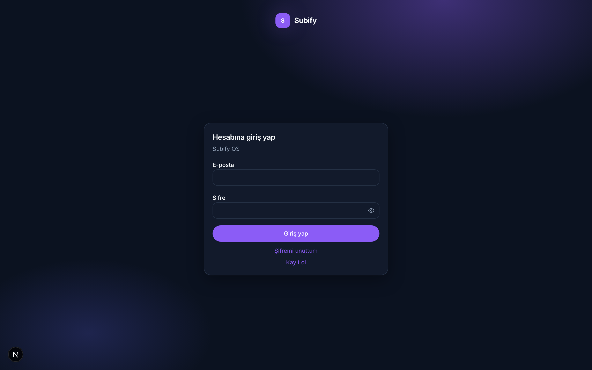
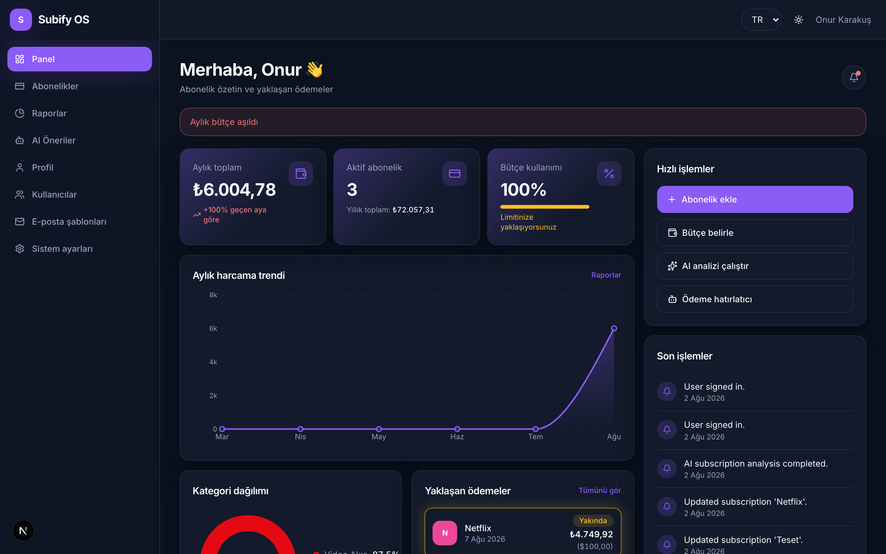
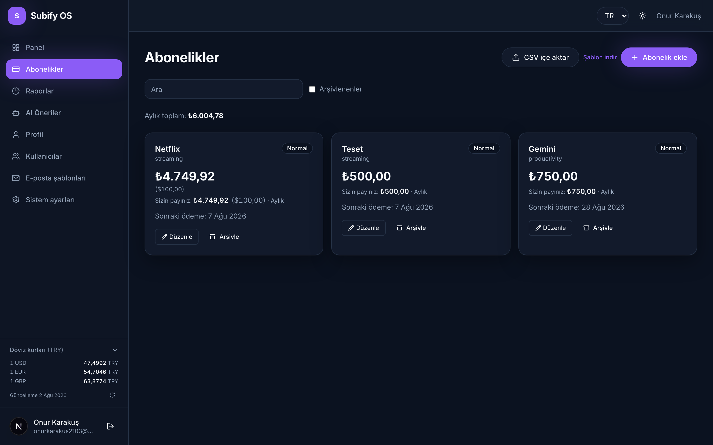
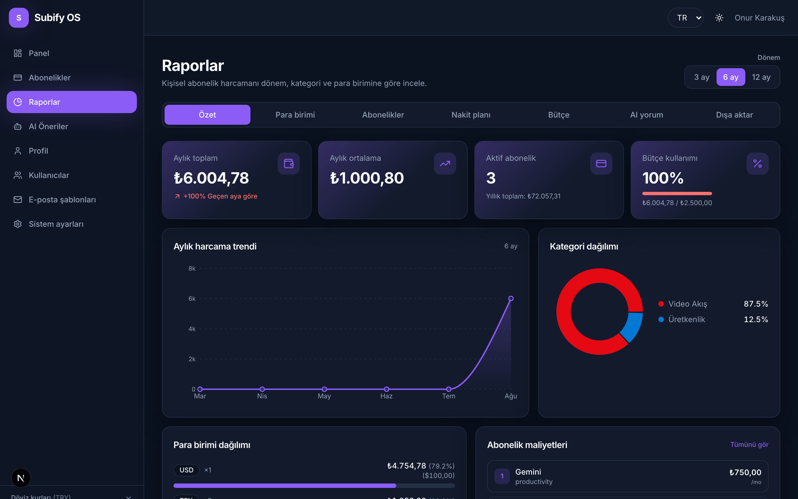
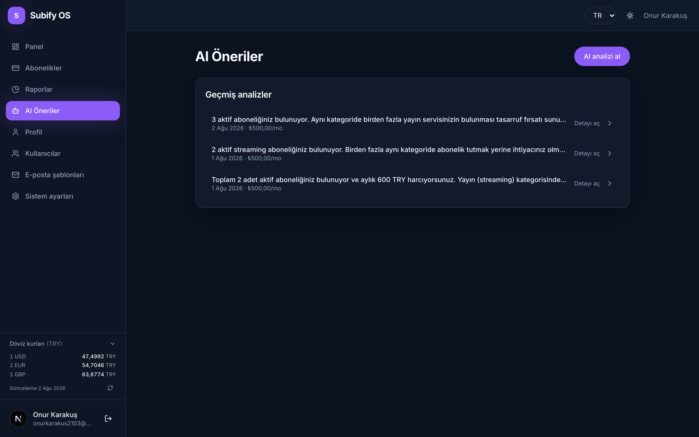
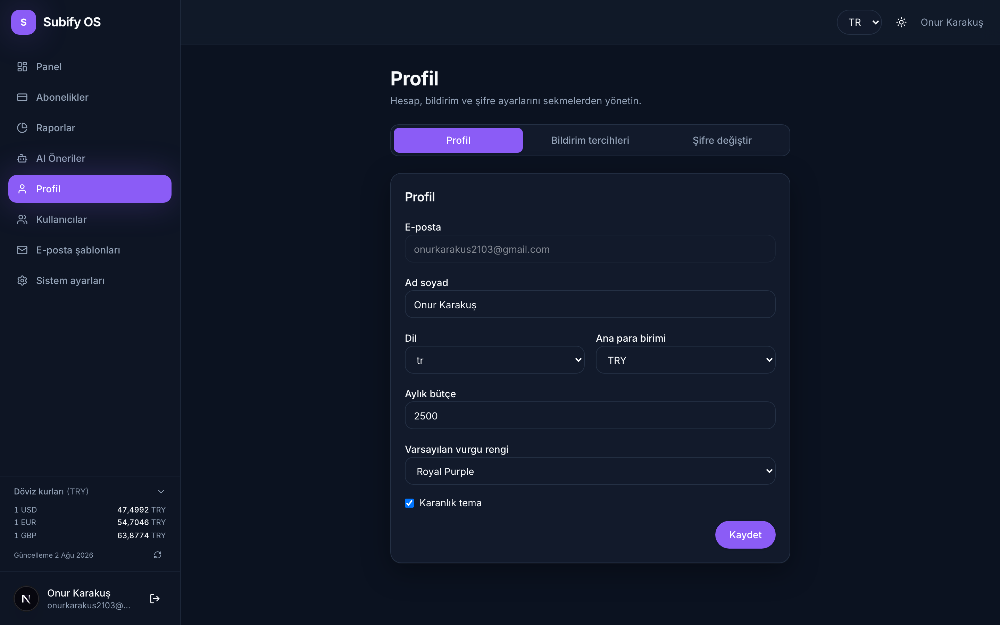
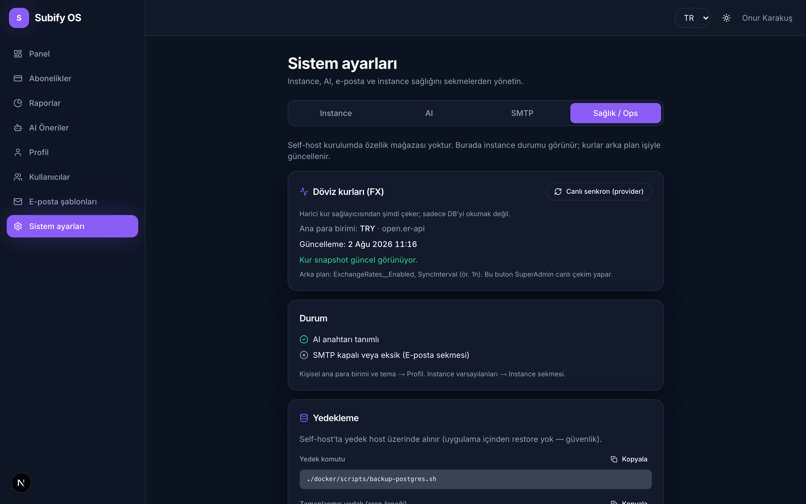
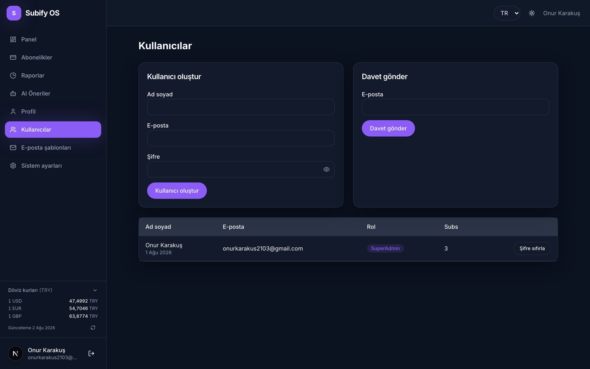

# Subify OS

### Own your subscriptions. Own your data. Zero freemium.

**Self-hosted subscription & personal finance tracker** — open source, no SaaS lock-in, no paywalls, no feature gates.

Track Netflix, Spotify, cloud seats, gym memberships and every recurring charge **on your own server**. Multi-currency with live FX, AI savings tips with *your* API key, email reminders with *your* SMTP, and a full admin/setup path for families and small teams.

<p align="center">
  <a href="#quick-start"></a>
  <a href="#tech-stack"></a>
  <a href="#tech-stack"></a>
  <a href="#tech-stack"></a>
  <a href="./LICENSE"></a>
</p>

<p align="center">
  <strong>No Stripe · No RevenueCat · No “upgrade to Pro” · No cloud telemetry by default</strong><br/>
  <em>Bring your own AI key. Bring your own SMTP. Keep the database at home.</em>
</p>

---

## Screenshots

> Captured from a **running local instance** of this repo (Next.js + API + PostgreSQL) — not design mockups.

### Landing & auth

<p align="center">
  
</p>

<p align="center">
  
</p>

### App

| Dashboard | Subscriptions |
| :-------: | :-----------: |
|  |  |

| Reports | AI tips |
| :-----: | :-----: |
|  |  |

| Profile | Admin · Health / Ops |
| :-----: | :------------------: |
|  |  |

<p align="center">
  
</p>

---

## Why Subify OS?

Most subscription apps want your data **and** a monthly fee. Subify OS is the opposite:

| Principle | What it means |
| --------- | ------------- |
| **Self-hosted first** | One `docker compose up` — API, web, Postgres. |
| **Your keys, your rules** | AI (OpenAI-compatible) and SMTP are **BYOK**. No vendor lock-in. |
| **No freemium theater** | Unlimited subscriptions on *your* instance. Limits are yours, not ours. |
| **Privacy by architecture** | Data lives in **your** PostgreSQL. No product analytics requirement. |
| **Built like a product, shipped like ops** | Setup wizard, Super Admin, invites, backup scripts, health endpoints. |

If you later want a managed cloud, we document a **separate** SaaS transition path — it does **not** pollute the open-source core with paywalls. See [`docs/SUBIFY_SAAS_TRANSITION_PRD.md`](docs/SUBIFY_SAAS_TRANSITION_PRD.md).

---

## Features

### Core money
- **Subscriptions** — create, update, archive/reactivate, shared-with split (`UserShare`)
- **Dashboard** — monthly/yearly totals, budget vs spend, upcoming renewals, activity
- **Reports** — monthly spend, category breakdown, currency distribution, dual FX display
- **Multi-currency** — main currency + original amount; FX snapshots (Open ER API); stale-rate UX
- **Price history** — “zam / indirim” signal when price or currency changes
- **What-if budget** — client-side scenario (exclude / switch to yearly)
- **ICS export** — push renewals into a calendar file
- **CSV import** — bulk add with dry-run preview

### Intelligence & mail
- **AI savings tips** — BYOK LLM (OpenAI-compatible); tip actions (open / archive / yearly)
- **Report commentary** — AI narrative on period spend (when AI is configured)
- **Email** — templates (reset, invite, renewal, report summary); Super Admin SMTP; test send
- **Renewal reminders** — background job + Super Admin manual run

### Ops & multi-user
- **First-run setup wizard** — Super Admin → instance → optional users / SMTP / AI
- **Invites** — admin invites family or team members
- **Admin** — users, system settings, email templates, provider catalog import
- **Ops tab** — FX live sync, backup commands, instance health (SMTP/AI ready)
- **i18n** — Turkish & English UI strings

---

## Tech stack

```
┌─────────────┐     JWT      ┌──────────────────┐     EF Core      ┌────────────┐
│  Next.js    │ ──────────▶  │  ASP.NET Core    │ ───────────────▶ │ PostgreSQL │
│  App Router │  ◀────────── │  Minimal APIs    │                  │            │
│  Tailwind   │   JSON API   │  MediatR CQRS    │   auto-migrate   └────────────┘
└─────────────┘              └────────┬─────────┘
                                      │
                    ┌─────────────────┼─────────────────┐
                    ▼                 ▼                 ▼
              FX provider        SMTP (BYOK)      LLM API (BYOK)
              background job     template engine   analyze / commentary
```

| Layer | Choice | Why |
| ----- | ------ | --- |
| **API** | ASP.NET Core · **.NET 10** | Clean Architecture, CQRS (MediatR), FluentValidation, Identity |
| **Web** | **Next.js** (App Router) · TypeScript · Tailwind | Fast UI, i18n-ready, self-hostable |
| **DB** | **PostgreSQL** | Boring, solid, Docker-friendly |
| **Jobs** | Hosted `BackgroundService` | FX sync, renewal mail — no Redis required for v1 |
| **Docs (dev)** | Scalar OpenAPI | `/scalar/v1` when `Development` |
| **Mobile** | Flutter | Roadmap after web+API |

**Architecture highlights**
- Domain-driven entities (subscription math, soft-archive, category XOR rules)
- Application layer handlers + Result types + domain error codes
- Infrastructure: EF Core, SMTP sender, FX client, AI client, email templates
- Security: JWT + refresh, CORS lockdown in production, secret masking in logs/settings, setup gate middleware

---

## Quick start

### Full stack (recommended)

```bash
git clone https://github.com/<you>/SubifyProject.git
cd SubifyProject/docker
cp .env.example .env
# set strong POSTGRES_PASSWORD and JWT_SECRET_KEY
docker compose up -d --build
```

| Service | URL |
| ------- | --- |
| **Web** | http://localhost:3000 |
| **API** | http://localhost:5240 |
| **Health** | http://localhost:5240/health |
| **Ready** | http://localhost:5240/health/ready |

On first boot the API **applies EF migrations and seeds** roles, categories, resources, and system settings.

Then open the web app and complete the **setup wizard** (Super Admin + instance defaults). Optional: SMTP and AI keys in Super Admin → System settings.

More: [`docker/README.md`](docker/README.md) · [`docs/OPS.md`](docs/OPS.md) (backup/restore scripts included).

### Dev mode (API & web on host, DB in Docker)

```bash
# Terminal 1 — Postgres
cd docker && docker compose -f docker-compose.db.yaml up -d

# Terminal 2 — API
cd api/Subify.Api && dotnet run --launch-profile http
# → http://localhost:5240  ·  Scalar: /scalar/v1

# Terminal 3 — Web
cd web && cp .env.example .env.local && npm install && npm run dev
# → http://localhost:3000  ·  NEXT_PUBLIC_API_URL=http://localhost:5240/api
```

### Backup in 10 seconds

```bash
./docker/scripts/backup-postgres.sh
# → ./backups/subify-YYYYMMDD-HHMMSS.dump
```

---

## Repository layout

```
SubifyProject/
├── api/                      # Clean Architecture backend
│   ├── Subify.Api/           # Endpoints, auth, middleware, Docker
│   ├── Subify.Application/   # CQRS handlers, validators, DTOs
│   ├── Subify.Domain/        # Entities, domain services, errors
│   ├── Subify.Infrastructure/# EF, FX, email, AI, background jobs
│   └── *.Tests/              # Unit & handler tests
├── web/                      # Next.js app (dashboard, admin, setup, AI…)
├── mobile/                   # Flutter (later)
├── docker/                   # Compose, Caddy/nginx samples, backup scripts
├── data/                     # Sample provider catalog JSON
├── docs/                     # Manifesto, PRD, task list, OPS, SaaS transition
├── LICENSE                   # MIT
└── README.md
```

---

## Documentation map

| Doc | Purpose |
| --- | ------- |
| [`docs/SUBIFY_OS_MANIFESTO.md`](docs/SUBIFY_OS_MANIFESTO.md) | Product constitution (self-host, no freemium) |
| [`docs/SUBIFY_OS_PRD.md`](docs/SUBIFY_OS_PRD.md) | Product requirements |
| [`docs/SUBIFY_OS_TASK_LIST.md`](docs/SUBIFY_OS_TASK_LIST.md) | Implementation checklist |
| [`docs/OPS.md`](docs/OPS.md) | Install, backup, upgrade, troubleshooting |
| [`docs/API_CONTRACTS.md`](docs/API_CONTRACTS.md) | API shapes |
| [`docs/DATA_MODEL.md`](docs/DATA_MODEL.md) | Data model notes |
| [`docs/SUBIFY_SAAS_TRANSITION_PRD.md`](docs/SUBIFY_SAAS_TRANSITION_PRD.md) | Optional future Cloud path (separate product) |

**Source of truth order:** Manifesto → OS PRD → OS task list → other docs.

---

## Configuration (high level)

| Concern | Where |
| ------- | ----- |
| DB / JWT / CORS | `docker/.env` or `appsettings` |
| Instance, SMTP, AI | Super Admin → **System settings** (UI) after setup |
| FX sync interval | `ExchangeRates__*` / appsettings (`Enabled`, `SyncInterval`) |
| Background jobs | `BackgroundJobs__Enabled` |
| Web API base URL | `NEXT_PUBLIC_API_URL` (rebuild web image if changed in Docker) |

Secrets never return in plain text from admin settings (masked placeholders).

---

## Security & ops (honest defaults)

- JWT access + refresh rotation model  
- Production CORS: empty allow-list = deny (set your real origin)  
- Setup incomplete → gated API (except setup/auth/health)  
- Sensitive Serilog destructuring (password / token / apiKey)  
- Non-root container users where applicable  
- Health + readiness probes for orchestration  

Report issues responsibly. For production, put TLS in front ([`docker/Caddyfile`](docker/Caddyfile) / nginx example).

---

## Roadmap (short)

- [x] Setup wizard, auth, subscriptions, reports, FX dual display  
- [x] AI analyze + email stack (BYOK)  
- [x] Admin ops, provider import, backup docs  
- [ ] Polish & tests (ongoing)  
- [ ] Flutter client against the same API  
- [ ] Optional tags / deeper community catalog  

Task-level detail: [`docs/SUBIFY_OS_TASK_LIST.md`](docs/SUBIFY_OS_TASK_LIST.md).

---

## Contributing

1. Read the **manifesto** — features that reintroduce freemium/paywalls into OS will be rejected.  
2. Prefer small PRs with tests for Application/Domain behavior.  
3. Keep i18n keys for new UI (TR + EN).  
4. Don’t commit real secrets; use `.env.example` only.

Issues and discussions welcome — especially self-host war stories and provider catalog contributions (`data/provider-catalog.sample.json`).

---

## License

**[MIT](./LICENSE)** — use it, fork it, self-host it, sell support if you want. The software stays free.

---

## Star if this is how software should work

If you believe **subscription tracking shouldn’t require a second subscription**, give the repo a ⭐ — it helps others find a private, self-hosted alternative.

```bash
docker compose up -d --build   # and never pay rent for your own bills again
```

<p align="center">
  <sub>Built with .NET, Next.js, and a stubborn preference for owning your stack.</sub>
</p>
