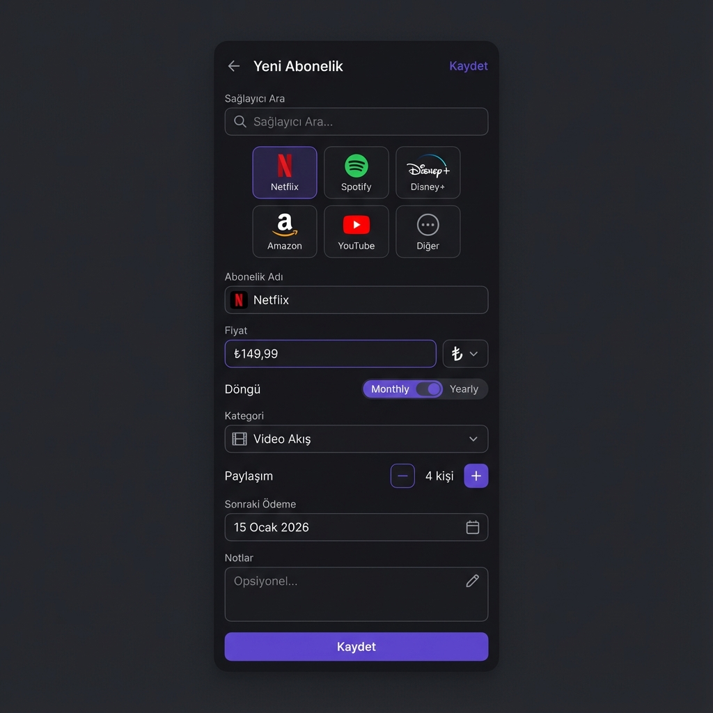
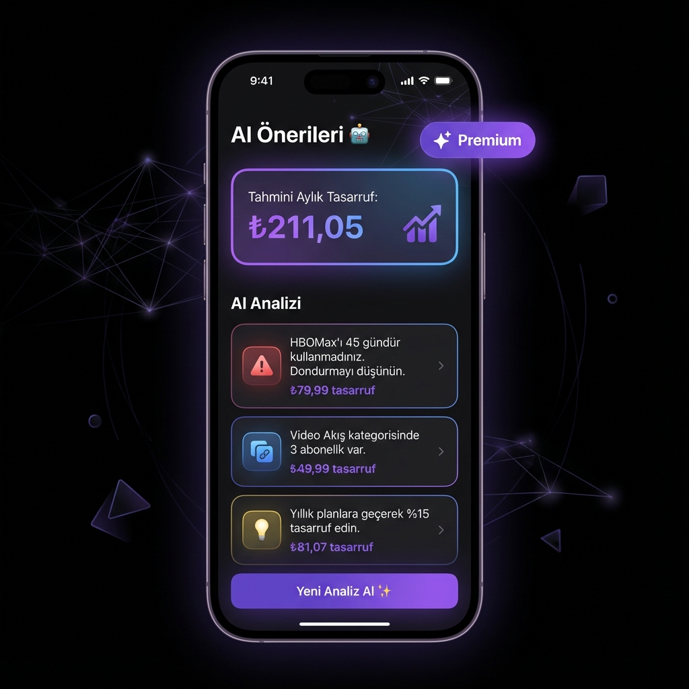
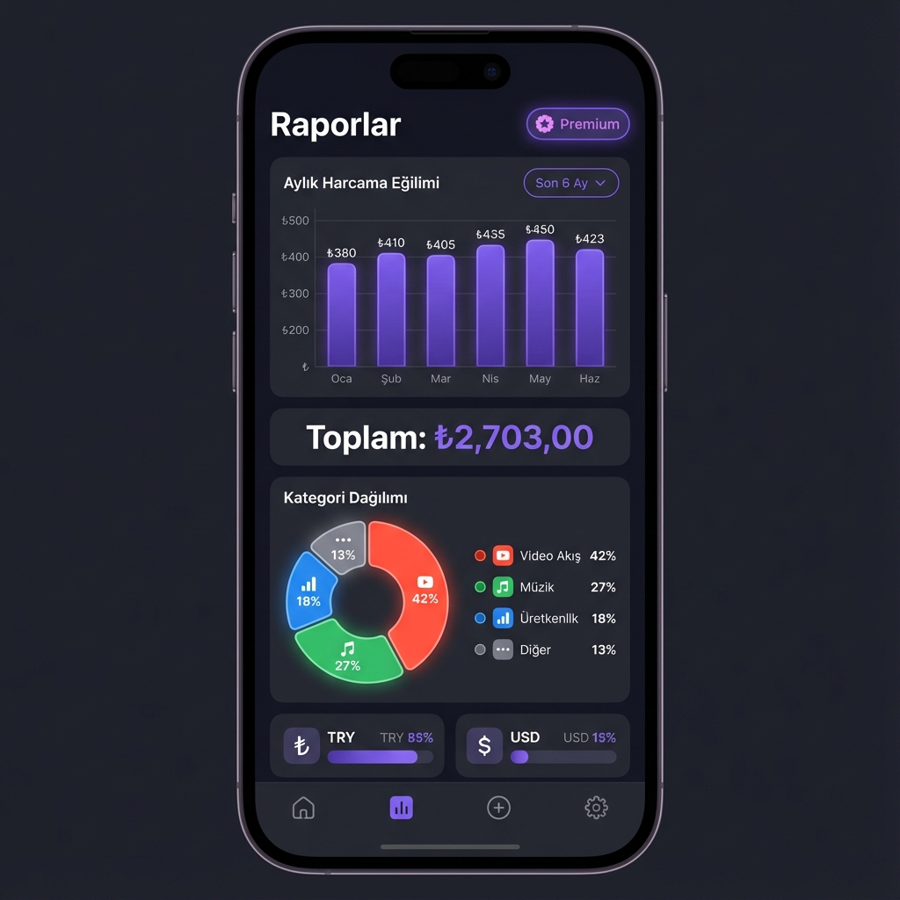
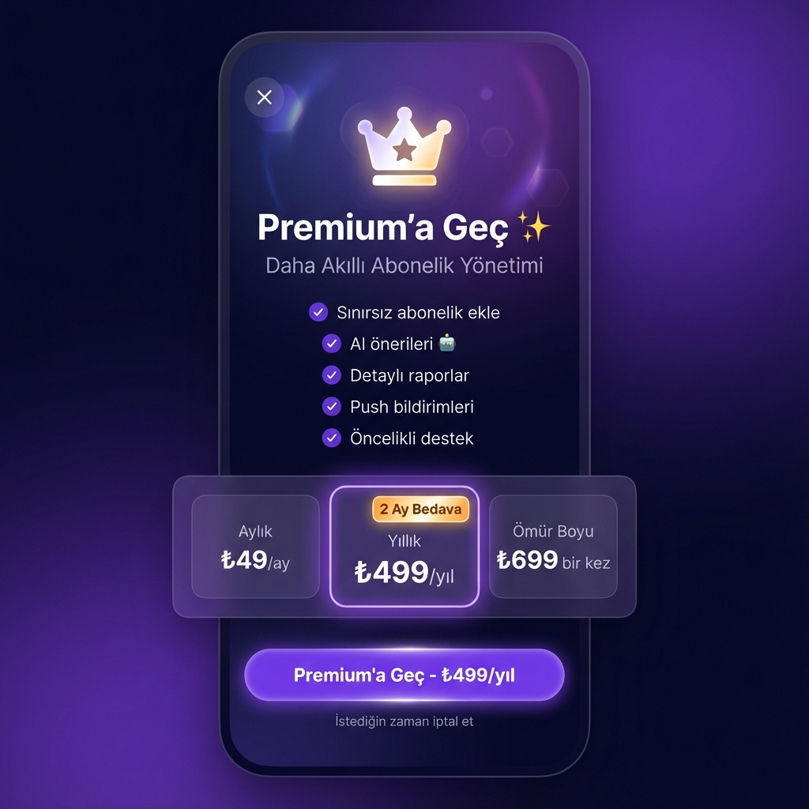
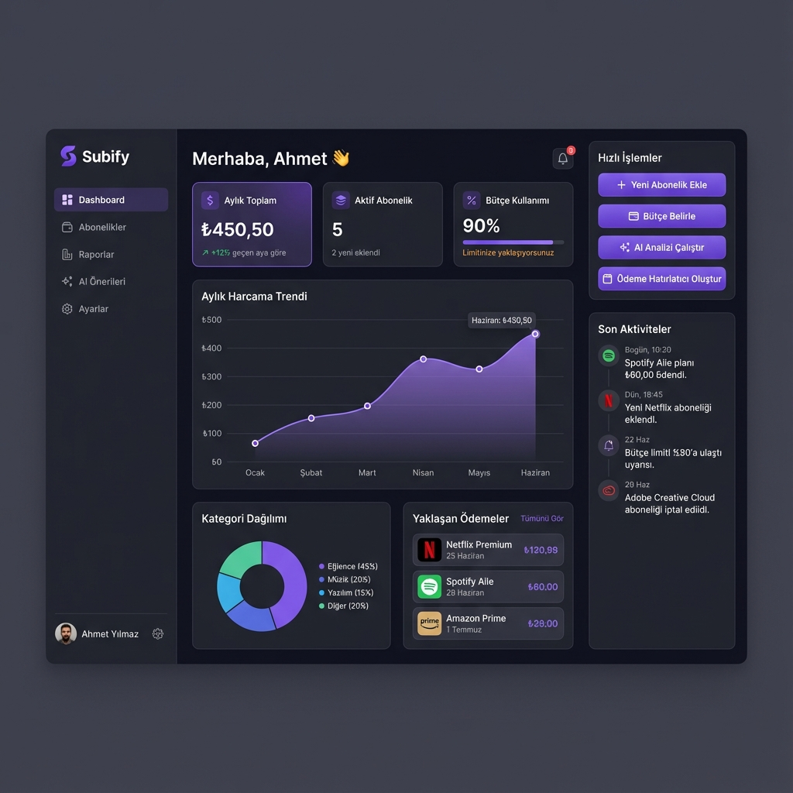
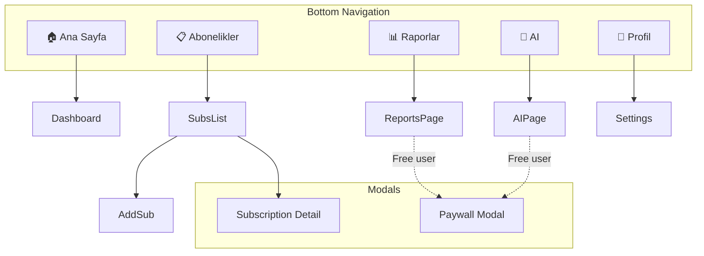

# Subify - UI Mockups

Bu doküman, Subify uygulamasının mobil ve web arayüz tasarımlarını içerir.

> **Geliştirme Önceliği:** Mobile First → Web → Admin
>
> **Referanslar:**
>
> - [Ana PRD](./Subify.Web.Uygulamasi.v2.PRD.md)
> - [Component Diagram](./diagrams/COMPONENT_DIAGRAM.md)

---

## 🎨 Tasarım Sistemi

### Renk Paleti

| Renk                | Hex       | Kullanım                        |
| ------------------- | --------- | ------------------------------- |
| **Primary Purple**  | `#6B46C1` | Ana aksiyon butonları, vurgular |
| **Primary Light**   | `#805AD5` | Hover durumları                 |
| **Primary Dark**    | `#553C9A` | Pressed durumları               |
| **Background Dark** | `#1A1A2E` | Ana arka plan                   |
| **Surface**         | `#16213E` | Kart arka planları              |
| **Surface Light**   | `#1F2937` | Alternatif yüzeyler             |
| **Text Primary**    | `#FFFFFF` | Ana metin                       |
| **Text Secondary**  | `#9CA3AF` | İkincil metin                   |
| **Success**         | `#10B981` | Başarı durumları                |
| **Warning**         | `#F59E0B` | Uyarılar                        |
| **Error**           | `#EF4444` | Hatalar                         |

### Tipografi

| Element | Font  | Size | Weight   |
| ------- | ----- | ---- | -------- |
| H1      | Inter | 32px | Bold     |
| H2      | Inter | 24px | SemiBold |
| H3      | Inter | 20px | SemiBold |
| Body    | Inter | 16px | Regular  |
| Caption | Inter | 14px | Regular  |
| Button  | Inter | 16px | Medium   |

### Tema Renkleri (Kullanıcı Seçimi)

| Tema          | Accent Color |
| ------------- | ------------ |
| Royal Purple  | `#6B46C1`    |
| Ocean Blue    | `#3B82F6`    |
| Forest Green  | `#10B981`    |
| Sunset Orange | `#F97316`    |
| Cherry Red    | `#EF4444`    |
| Golden Yellow | `#EAB308`    |

---

## 📱 Mobile Mockups (Flutter)

### 1. Dashboard


**Sayfa Açıklaması:**

- Kullanıcı selamlaması ve avatar
- Aylık/Yıllık toplam harcama özeti
- Bütçe kullanım progress bar'ı
- Yaklaşan ödemeler listesi
- Alt navigasyon bar'ı

**Bileşenler:**
| Bileşen | Açıklama |
|---------|----------|
| `SummaryCard` | Toplam harcama kartları |
| `BudgetProgressBar` | Bütçe kullanım göstergesi |
| `UpcomingPaymentCard` | Yaklaşan ödeme kartı |
| `BottomNavBar` | 5 sekmeli navigasyon |

---

### 2. Abonelik Listesi


**Sayfa Açıklaması:**

- Kategori filtre chip'leri
- Abonelik kartları listesi
- Her kartta: logo, isim, fiyat, kategori, paylaşım badge
- Floating Action Button (+ Ekle)

**Bileşenler:**
| Bileşen | Açıklama |
|---------|----------|
| `CategoryFilterChips` | Yatay scroll kategori filtreleri |
| `SubscriptionCard` | Abonelik özet kartı |
| `SharedBadge` | Paylaşım sayısı göstergesi |
| `FAB` | Yeni abonelik ekleme butonu |

---

### 3. Abonelik Ekleme



**Sayfa Açıklaması:**

- Sağlayıcı arama ve popüler sağlayıcılar
- Form alanları (isim, fiyat, döngü, kategori, paylaşım, tarih)
- Kaydet butonu

**Bileşenler:**
| Bileşen | Açıklama |
|---------|----------|
| `ProviderSearchField` | Sağlayıcı arama input'u |
| `ProviderGrid` | Popüler sağlayıcı logoları |
| `CurrencyInput` | Fiyat + para birimi seçici |
| `BillingCycleToggle` | Aylık/Yıllık toggle |
| `SharedCountStepper` | Paylaşım sayısı +/- stepper |
| `DatePicker` | Ödeme tarihi seçici |

---

### 4. AI Önerileri (Premium)



**Sayfa Açıklaması:**

- Premium badge
- Tahmini tasarruf özeti
- AI öneri kartları (kullanılmayan, tekrar, genel tip)
- Yeni analiz butonu

**Bileşenler:**
| Bileşen | Açıklama |
|---------|----------|
| `PremiumBadge` | Premium kullanıcı göstergesi |
| `SavingSummaryCard` | Toplam tasarruf özeti |
| `AISuggestionCard` | Tip bazlı öneri kartı |
| `AnalyzeButton` | AI analiz tetikleme butonu |

**Free Kullanıcı Durumu:**

- Blur efekti ile kilitli içerik
- "Premium'a Geç" CTA butonu

---

### 5. Raporlar (Premium)



**Sayfa Açıklaması:**

- Zaman dilimi seçici
- Aylık harcama trend grafiği
- Kategori dağılımı pasta grafiği
- Para birimi dağılımı

**Bileşenler:**
| Bileşen | Açıklama |
|---------|----------|
| `TimePeriodSelector` | Dropdown zaman seçici |
| `BarChart` | Aylık trend grafik |
| `DonutChart` | Kategori dağılımı |
| `LegendItem` | Grafik legend öğesi |

**Grafikler için Önerilen Kütüphaneler:**

- `fl_chart` (Flutter)
- Recharts (Web)

---

### 6. Paywall



**Sayfa Açıklaması:**

- Premium ikonografi
- Faydalar listesi
- 3 fiyatlandırma seçeneği (Aylık, Yıllık, Ömür Boyu)
- Ana CTA butonu
- İptal garantisi metni

**Bileşenler:**
| Bileşen | Açıklama |
|---------|----------|
| `BenefitsList` | Checkmark'lı fayda listesi |
| `PricingCard` | Seçilebilir fiyat kartı |
| `PrimaryButton` | Ana aksiyon butonu |
| `DiscountBadge` | "2 Ay Bedava" etiketi |

**RevenueCat Entegrasyonu:**

- `Purchases.getOfferings()` ile fiyatlar çekilir
- `Purchases.purchasePackage()` ile satın alma tetiklenir

---

## 🌐 Web Mockups (Next.js)

### 1. Landing Page


**Sayfa Açıklaması:**

- Navigasyon bar'ı
- Hero section (başlık, alt başlık, CTA'lar)
- Özellikler bölümü
- Sosyal kanıt

**Route:** `/`

**SEO:**

```html
<title>Subify - Aboneliklerini Tek Yerden Yönet</title>
<meta
  name="description"
  content="Netflix, Spotify ve daha fazlasını takip et. AI ile tasarruf önerileri al."
/>
```

---

### 2. Dashboard



**Sayfa Açıklaması:**

- Sol sidebar navigasyon
- Özet stat kartları
- Trend grafiği
- Yaklaşan ödemeler
- Kategori dağılımı

**Route:** `/app` (Protected)

**Bileşenler:**
| Bileşen | Açıklama |
|---------|----------|
| `Sidebar` | Collapsible navigasyon |
| `StatCard` | KPI özet kartları |
| `LineChart` | Trend grafiği |
| `SubscriptionRow` | Yaklaşan ödeme satırı |

---

### 3. Admin Panel - Email Templates


**Sayfa Açıklaması:**

- Admin sidebar
- Email şablonları tablosu
- Filtre ve arama
- CRUD işlemleri

**Route:** `/admin/email-templates` (Role: Admin)

**Bileşenler:**
| Bileşen | Açıklama |
|---------|----------|
| `AdminSidebar` | Admin navigasyonu |
| `DataTable` | Sortable/filterable tablo |
| `ActionButtons` | Edit/Delete butonları |
| `LanguageFilter` | TR/EN filtresi |

---

## 📐 Sayfa Yapıları

### Mobile Navigation Flow



### Web Route Structure

```
/ (Public)
├── /features
├── /pricing
├── /login
├── /register
├── /forgot-password
├── /reset-password
└── /confirm-email

/app (Protected - User)
├── /app (Dashboard)
├── /app/subscriptions
│   ├── /app/subscriptions/new
│   └── /app/subscriptions/[id]
├── /app/reports
├── /app/ai
└── /app/settings
    ├── /app/settings/profile
    ├── /app/settings/notifications
    └── /app/settings/billing

/admin (Protected - Admin Role)
├── /admin (Dashboard)
├── /admin/users
├── /admin/transactions
├── /admin/email-templates
│   └── /admin/email-templates/[id]
└── /admin/logs
```

---

## 📱 Responsive Breakpoints

| Breakpoint | Width    | Target             |
| ---------- | -------- | ------------------ |
| xs         | < 576px  | Mobile (portrait)  |
| sm         | ≥ 576px  | Mobile (landscape) |
| md         | ≥ 768px  | Tablet             |
| lg         | ≥ 992px  | Desktop            |
| xl         | ≥ 1200px | Large Desktop      |
| xxl        | ≥ 1400px | Ultra-wide         |

---

## 🎭 State Variations

### Subscription Card States

| State                   | Visual                           |
| ----------------------- | -------------------------------- |
| **Normal**              | Standart görünüm                 |
| **Upcoming (< 3 days)** | Sarı border, "Yakında" badge     |
| **Overdue**             | Kırmızı border, "Gecikmiş" badge |
| **Shared**              | Paylaşım ikonu + sayı            |
| **Archived**            | Soluk/grayed out                 |

### Button States

| State    | Visual             |
| -------- | ------------------ |
| Default  | Normal renk        |
| Hover    | Açık ton           |
| Pressed  | Koyu ton           |
| Disabled | %50 opacity        |
| Loading  | Spinner + disabled |

### Premium Gating

| Feature State      | Free User  | Premium User |
| ------------------ | ---------- | ------------ |
| Reports            | Blur + CTA | Full access  |
| AI Suggestions     | Blur + CTA | Full access  |
| Push Notifications | Disabled   | Enabled      |
| Subscription Limit | Max 3      | Unlimited    |

---

## 🔗 Mockup Dosyaları

Tüm mockup dosyaları aşağıdaki dizinde bulunmaktadır:

```
docs/mockups/
├── mobile_dashboard_*.png
├── mobile_subscriptions_list_*.png
├── mobile_add_subscription_*.png
├── mobile_ai_suggestions_*.png
├── mobile_reports_*.png
├── mobile_paywall_*.png
├── web_landing_page_*.png
├── web_dashboard_*.png
└── web_admin_panel_*.png
```

---

## ✅ Tasarım Checklist

### Mobile (Flutter)

- [ ] Dashboard ekranı
- [ ] Abonelik listesi
- [ ] Abonelik ekleme formu
- [ ] Abonelik detay/düzenleme
- [ ] Raporlar ekranı
- [ ] AI önerileri ekranı
- [ ] Profil/Ayarlar ekranı
- [ ] Paywall modal
- [ ] Auth ekranları (Login/Register/Forgot)
- [ ] Boş state (ilk kullanım)
- [ ] Error state
- [ ] Loading state

### Web (Next.js)

- [ ] Landing page
- [ ] Login/Register sayfaları
- [ ] Dashboard
- [ ] Abonelikler sayfası
- [ ] Raporlar sayfası
- [ ] AI önerileri sayfası
- [ ] Ayarlar sayfaları
- [ ] Admin: Users
- [ ] Admin: Email Templates
- [ ] Admin: System Stats
- [ ] Admin: Logs
