# Subify - Deployment Diagram

Bu doküman, Subify uygulamasının VPS üzerindeki deployment yapısını Docker Compose ile görselleştirir.

> **Referanslar:**
>
> - [Ana PRD](../Subify.Web.Uygulamasi.v2.PRD.md)
> - [Component Diagram](./COMPONENT_DIAGRAM.md)

---

## 🏗️ Deployment Architecture

```mermaid
graph TB
    subgraph Internet["🌐 Internet"]
        Users["👥 Users"]
        Cloudflare["☁️ Cloudflare (Optional CDN)"]
    end

    subgraph VPS["🖥️ VPS (Linux)"]
        subgraph Docker["🐳 Docker Compose"]
            ReverseProxy["🔀 Reverse Proxy<br/>(Nginx/Caddy)<br/>:80/:443"]

            subgraph Frontend["Frontend"]
                NextJS["📦 frontend<br/>(Next.js)<br/>:3000"]
            end

            subgraph Backend["Backend"]
                API["📦 api<br/>(ASP.NET Core)<br/>:5000"]
                Worker["📦 worker<br/>(Hangfire)<br/>:5001"]
            end

            subgraph Data["Data Layer"]
                MSSQL["📦 db<br/>(MSSQL)<br/>:1433"]
                Redis["📦 redis<br/>(Redis)<br/>:6379"]
            end

            subgraph Monitoring["Monitoring (Optional)"]
                Otel["📦 otel-collector<br/>:4317"]
            end
        end

        subgraph Volumes["💾 Docker Volumes"]
            DBVolume["db-data"]
            RedisVolume["redis-data"]
            CertsVolume["certs"]
        end
    end

    Users --> Cloudflare
    Cloudflare --> ReverseProxy
    ReverseProxy -->|/| NextJS
    ReverseProxy -->|/api| API
    API --> MSSQL
    API --> Redis
    Worker --> MSSQL
    Worker --> Redis
    MSSQL --> DBVolume
    Redis --> RedisVolume
    ReverseProxy --> CertsVolume
```



---

## 📦 Docker Compose Configuration

```yaml
# docker-compose.yml
version: "3.8"

services:
  # Reverse Proxy - TLS Termination
  reverse-proxy:
    image: caddy:2-alpine
    container_name: subify-proxy
    restart: unless-stopped
    ports:
      - "80:80"
      - "443:443"
    volumes:
      - ./Caddyfile:/etc/caddy/Caddyfile
      - certs:/data
      - certs:/config
    networks:
      - subify-network
    depends_on:
      - frontend
      - api

  # Frontend - Next.js
  frontend:
    build:
      context: ./frontend
      dockerfile: Dockerfile
    container_name: subify-frontend
    restart: unless-stopped
    environment:
      - NODE_ENV=production
      - NEXT_PUBLIC_API_URL=https://api.subify.app
    networks:
      - subify-network
    depends_on:
      - api

  # Backend API - ASP.NET Core
  api:
    build:
      context: ./backend
      dockerfile: Dockerfile
    container_name: subify-api
    restart: unless-stopped
    environment:
      - ASPNETCORE_ENVIRONMENT=Production
      - ConnectionStrings__DefaultConnection=${DB_CONNECTION_STRING}
      - ConnectionStrings__Redis=${REDIS_CONNECTION_STRING}
      - Jwt__SecretKey=${JWT_SECRET}
      - RevenueCat__ApiKey=${REVENUECAT_API_KEY}
      - OpenAI__ApiKey=${OPENAI_API_KEY}
      - Smtp__Host=${SMTP_HOST}
      - Smtp__ApiKey=${SMTP_API_KEY}
    networks:
      - subify-network
    depends_on:
      db:
        condition: service_healthy
      redis:
        condition: service_started

  # Background Worker - Hangfire
  worker:
    build:
      context: ./backend
      dockerfile: Dockerfile
    container_name: subify-worker
    restart: unless-stopped
    environment:
      - ASPNETCORE_ENVIRONMENT=Production
      - WORKER_MODE=true
      - ConnectionStrings__DefaultConnection=${DB_CONNECTION_STRING}
      - ConnectionStrings__Redis=${REDIS_CONNECTION_STRING}
      - Smtp__Host=${SMTP_HOST}
      - Smtp__ApiKey=${SMTP_API_KEY}
      - Firebase__ServiceAccountPath=/app/firebase-sa.json
    volumes:
      - ./secrets/firebase-sa.json:/app/firebase-sa.json:ro
    networks:
      - subify-network
    depends_on:
      db:
        condition: service_healthy
      redis:
        condition: service_started

  # Database - MSSQL Server
  db:
    image: mcr.microsoft.com/mssql/server:2022-latest
    container_name: subify-db
    restart: unless-stopped
    environment:
      - ACCEPT_EULA=Y
      - SA_PASSWORD=${DB_SA_PASSWORD}
      - MSSQL_PID=Express
    ports:
      - "1433:1433" # Remove in production or use internal only
    volumes:
      - db-data:/var/opt/mssql
    networks:
      - subify-network
    healthcheck:
      test: /opt/mssql-tools/bin/sqlcmd -S localhost -U sa -P "$$SA_PASSWORD" -Q "SELECT 1"
      interval: 10s
      timeout: 3s
      retries: 10
      start_period: 30s

  # Cache - Redis
  redis:
    image: redis:7-alpine
    container_name: subify-redis
    restart: unless-stopped
    command: redis-server --appendonly yes
    volumes:
      - redis-data:/data
    networks:
      - subify-network

  # OpenTelemetry Collector (Optional)
  otel-collector:
    image: otel/opentelemetry-collector-contrib:latest
    container_name: subify-otel
    restart: unless-stopped
    command: ["--config=/etc/otel-collector-config.yaml"]
    volumes:
      - ./otel-collector-config.yaml:/etc/otel-collector-config.yaml:ro
    networks:
      - subify-network

volumes:
  db-data:
  redis-data:
  certs:

networks:
  subify-network:
    driver: bridge
```

---

## 🔀 Reverse Proxy Configuration

### Caddy (Recommended)

```caddyfile
# Caddyfile

# Main domain - Next.js Frontend
subify.app {
    reverse_proxy frontend:3000
}

# API subdomain
api.subify.app {
    reverse_proxy api:5000

    # Rate limiting headers
    header {
        X-Content-Type-Options nosniff
        X-Frame-Options DENY
        X-XSS-Protection "1; mode=block"
        Referrer-Policy strict-origin-when-cross-origin
    }
}

# Hangfire Dashboard (Admin only, IP restricted)
hangfire.subify.app {
    @allowed {
        remote_ip 10.0.0.0/8 172.16.0.0/12 192.168.0.0/16
    }
    reverse_proxy @allowed worker:5001
}
```

### Nginx Alternative

```nginx
# nginx.conf

upstream frontend {
    server frontend:3000;
}

upstream api {
    server api:5000;
}

server {
    listen 80;
    server_name subify.app api.subify.app;
    return 301 https://$server_name$request_uri;
}

server {
    listen 443 ssl http2;
    server_name subify.app;

    ssl_certificate /etc/letsencrypt/live/subify.app/fullchain.pem;
    ssl_certificate_key /etc/letsencrypt/live/subify.app/privkey.pem;

    location / {
        proxy_pass http://frontend;
        proxy_http_version 1.1;
        proxy_set_header Upgrade $http_upgrade;
        proxy_set_header Connection 'upgrade';
        proxy_set_header Host $host;
        proxy_cache_bypass $http_upgrade;
    }
}

server {
    listen 443 ssl http2;
    server_name api.subify.app;

    ssl_certificate /etc/letsencrypt/live/api.subify.app/fullchain.pem;
    ssl_certificate_key /etc/letsencrypt/live/api.subify.app/privkey.pem;

    # Security headers
    add_header X-Content-Type-Options nosniff;
    add_header X-Frame-Options DENY;
    add_header X-XSS-Protection "1; mode=block";

    location / {
        proxy_pass http://api;
        proxy_http_version 1.1;
        proxy_set_header Host $host;
        proxy_set_header X-Real-IP $remote_addr;
        proxy_set_header X-Forwarded-For $proxy_add_x_forwarded_for;
        proxy_set_header X-Forwarded-Proto $scheme;
    }
}
```

---

## 🔌 Port Mappings

| Service        | Internal Port | External Port   | Protocol   |
| -------------- | ------------- | --------------- | ---------- |
| reverse-proxy  | 80, 443       | 80, 443         | HTTP/HTTPS |
| frontend       | 3000          | - (internal)    | HTTP       |
| api            | 5000          | - (internal)    | HTTP       |
| worker         | 5001          | - (internal)    | HTTP       |
| db             | 1433          | 1433 (dev only) | TCP        |
| redis          | 6379          | - (internal)    | TCP        |
| otel-collector | 4317, 4318    | - (internal)    | gRPC/HTTP  |

---

## 🌐 Network Flow


---

## 💾 Volume Strategy

| Volume     | Container     | Mount Point    | Purpose               |
| ---------- | ------------- | -------------- | --------------------- |
| db-data    | db            | /var/opt/mssql | MSSQL data files      |
| redis-data | redis         | /data          | Redis AOF persistence |
| certs      | reverse-proxy | /data, /config | TLS certificates      |

---

## 🔐 Environment Variables

```bash
# .env (VPS)

# Database
DB_CONNECTION_STRING=Server=db;Database=SubifyDB;User Id=sa;Password=${DB_SA_PASSWORD};TrustServerCertificate=True
DB_SA_PASSWORD=<strong-password>

# Redis
REDIS_CONNECTION_STRING=redis:6379

# JWT
JWT_SECRET=<256-bit-secret>
JWT_ISSUER=https://api.subify.app
JWT_AUDIENCE=https://subify.app

# RevenueCat
REVENUECAT_API_KEY=<api-key>
REVENUECAT_WEBHOOK_SECRET=<webhook-secret>

# OpenAI
OPENAI_API_KEY=<api-key>

# SMTP / Resend
SMTP_HOST=smtp.resend.com
SMTP_PORT=587
SMTP_API_KEY=<api-key>
SMTP_FROM=noreply@subify.app

# Firebase
FIREBASE_PROJECT_ID=subify-app
# Service account JSON is mounted as volume

# Exchange Rate API
EXCHANGE_RATE_API_KEY=<api-key>
```

> [!CAUTION] > **Never commit .env file to version control!** Use secrets management (1Password, HashiCorp Vault, or cloud provider secrets manager) in production.

---

## 🚀 CI/CD Pipeline


### GitHub Actions Workflow

```yaml
# .github/workflows/deploy.yml

name: Deploy to VPS

on:
  push:
    branches: [main]

jobs:
  test:
    runs-on: ubuntu-latest
    steps:
      - uses: actions/checkout@v4

      - name: Setup .NET
        uses: actions/setup-dotnet@v4
        with:
          dotnet-version: "8.0.x"

      - name: Run tests
        run: dotnet test ./backend/Subify.sln

      - name: Setup Node.js
        uses: actions/setup-node@v4
        with:
          node-version: "20"

      - name: Frontend lint & build
        run: |
          cd frontend
          npm ci
          npm run lint
          npm run build

  deploy:
    needs: test
    runs-on: ubuntu-latest
    steps:
      - uses: actions/checkout@v4

      - name: Deploy via SSH
        uses: appleboy/ssh-action@v1
        with:
          host: ${{ secrets.VPS_HOST }}
          username: ${{ secrets.VPS_USER }}
          key: ${{ secrets.VPS_SSH_KEY }}
          script: |
            cd /opt/subify
            git pull origin main
            docker-compose pull
            docker-compose up -d --build
            docker exec subify-api dotnet ef database update
            curl -f https://api.subify.app/health || exit 1
```

---

## 📊 Health Checks

| Endpoint            | Purpose         | Expected Response       |
| ------------------- | --------------- | ----------------------- |
| `GET /health`       | Overall health  | 200 OK                  |
| `GET /health/ready` | Readiness probe | 200 OK (all deps ready) |
| `GET /health/live`  | Liveness probe  | 200 OK (app alive)      |

```csharp
// Startup.cs
builder.Services.AddHealthChecks()
    .AddSqlServer(connectionString, name: "mssql")
    .AddRedis(redisConnectionString, name: "redis")
    .AddUrlGroup(new Uri("https://api.revenuecat.com"), name: "revenuecat");
```

---

## 🔄 Backup Strategy


### Backup Script

```bash
#!/bin/bash
# backup.sh

DATE=$(date +%Y%m%d_%H%M%S)
BACKUP_DIR=/backups

# MSSQL backup
docker exec subify-db /opt/mssql-tools/bin/sqlcmd \
  -S localhost -U sa -P "$DB_SA_PASSWORD" \
  -Q "BACKUP DATABASE SubifyDB TO DISK='/var/opt/mssql/backup/subify_$DATE.bak'"

# Copy to backup dir
docker cp subify-db:/var/opt/mssql/backup/subify_$DATE.bak $BACKUP_DIR/

# Redis RDB
docker exec subify-redis redis-cli BGSAVE
sleep 5
docker cp subify-redis:/data/dump.rdb $BACKUP_DIR/redis_$DATE.rdb

# Upload to S3
aws s3 sync $BACKUP_DIR s3://subify-backups/ --exclude "*" --include "*.bak" --include "*.rdb"

# Cleanup old local backups (keep last 7 days)
find $BACKUP_DIR -type f -mtime +7 -delete
```

---

## 📈 Scaling Considerations

### Current (Single VPS)

- ✅ Suitable for MVP
- ✅ Low cost (~$20-50/month)
- ⚠️ Single point of failure
- ⚠️ Manual scaling

### Future (Multi-instance)


