# Subify - Sequence Diagrams

Bu doküman, Subify uygulamasının kritik akışlarını Mermaid sequence diyagramları ile görselleştirir.

> **Referanslar:**
>
> - [Ana PRD](../Subify.Web.Uygulamasi.v2.PRD.md)
> - [API Contracts](../API_CONTRACTS.md)

---

## 📋 İçindekiler

1. [User Registration & Email Verification](#1-user-registration--email-verification)
2. [JWT Authentication & Token Refresh](#2-jwt-authentication--token-refresh)
3. [Subscription CRUD with Limit Check](#3-subscription-crud-with-limit-check)
4. [RevenueCat Payment Flow (Web)](#4-revenuecat-payment-flow-web)
5. [RevenueCat Payment Flow (Mobile)](#5-revenuecat-payment-flow-mobile)
6. [AI Suggestion Request](#6-ai-suggestion-request)
7. [Push Notification Registration](#7-push-notification-registration)
8. [Renewal Reminder Flow](#8-renewal-reminder-flow)
9. [Resource Localization Sync](#9-resource-localization-sync)
10. [Exchange Rate Sync](#10-exchange-rate-sync)

---

## 1. User Registration & Email Verification

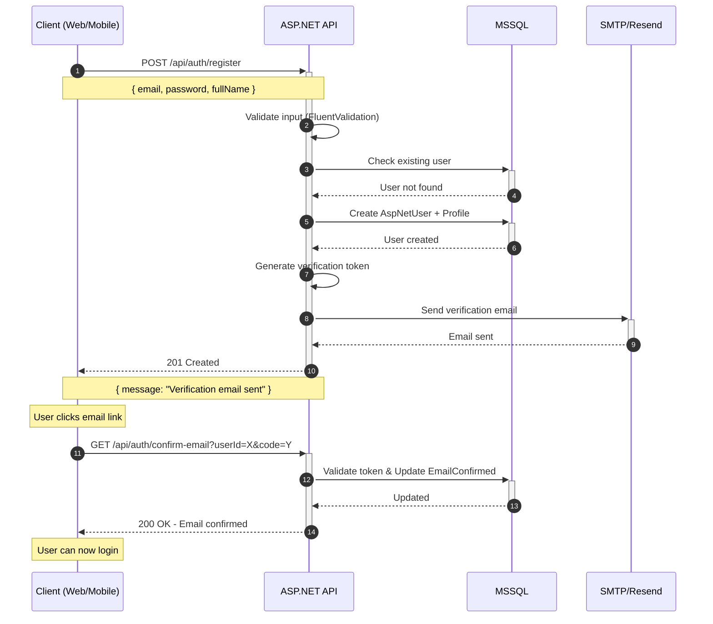
```mermaid
sequenceDiagram
    autonumber
    participant C as Client (Web/Mobile)
    participant API as ASP.NET API
    participant DB as MSSQL
    participant Email as SMTP/Resend

    C->>+API: POST /api/auth/register
    Note over C,API: { email, password, fullName }

    API->>API: Validate input (FluentValidation)
    API->>+DB: Check existing user
    DB-->>-API: User not found

    API->>+DB: Create AspNetUser + Profile
    DB-->>-API: User created

    API->>API: Generate verification token
    API->>+Email: Send verification email
    Email-->>-API: Email sent

    API-->>-C: 201 Created
    Note over C,API: { message: "Verification email sent" }

    Note over C: User clicks email link

    C->>+API: GET /api/auth/confirm-email?userId=X&code=Y
    API->>+DB: Validate token & Update EmailConfirmed
    DB-->>-API: Updated
    API-->>-C: 200 OK - Email confirmed

    Note over C: User can now login
```

---

## 2. JWT Authentication & Token Refresh

### 2.1 Login Flow

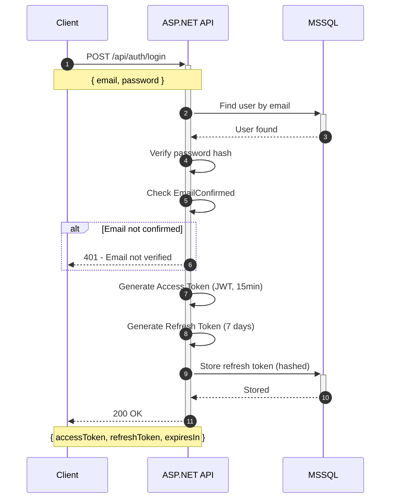
```mermaid
sequenceDiagram
    autonumber
    participant C as Client
    participant API as ASP.NET API
    participant DB as MSSQL

    C->>+API: POST /api/auth/login
    Note over C,API: { email, password }

    API->>+DB: Find user by email
    DB-->>-API: User found

    API->>API: Verify password hash
    API->>API: Check EmailConfirmed

    alt Email not confirmed
        API-->>C: 401 - Email not verified
    end

    API->>API: Generate Access Token (JWT, 15min)
    API->>API: Generate Refresh Token (7 days)

    API->>+DB: Store refresh token (hashed)
    DB-->>-API: Stored

    API-->>-C: 200 OK
    Note over C,API: { accessToken, refreshToken, expiresIn }
```

### 2.2 Token Refresh Flow

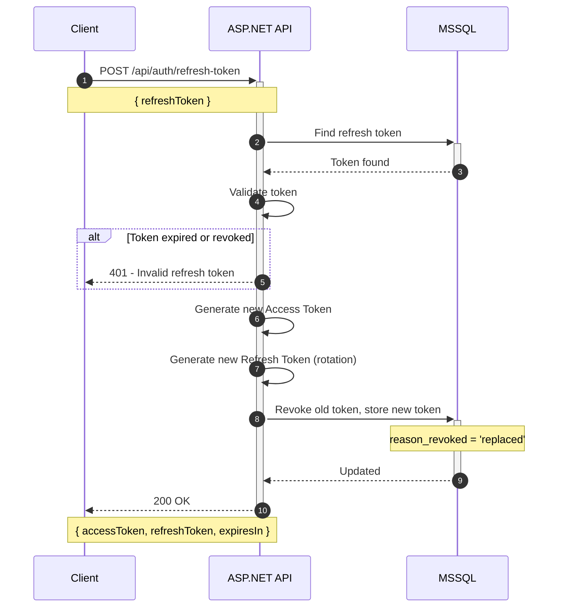
```mermaid
sequenceDiagram
    autonumber
    participant C as Client
    participant API as ASP.NET API
    participant DB as MSSQL

    C->>+API: POST /api/auth/refresh-token
    Note over C,API: { refreshToken }

    API->>+DB: Find refresh token
    DB-->>-API: Token found

    API->>API: Validate token

    alt Token expired or revoked
        API-->>C: 401 - Invalid refresh token
    end

    API->>API: Generate new Access Token
    API->>API: Generate new Refresh Token (rotation)

    API->>+DB: Revoke old token, store new token
    Note over DB: reason_revoked = 'replaced'
    DB-->>-API: Updated

    API-->>-C: 200 OK
    Note over C,API: { accessToken, refreshToken, expiresIn }
```

### 2.3 Mobile Token Refresh (Dio Interceptor)

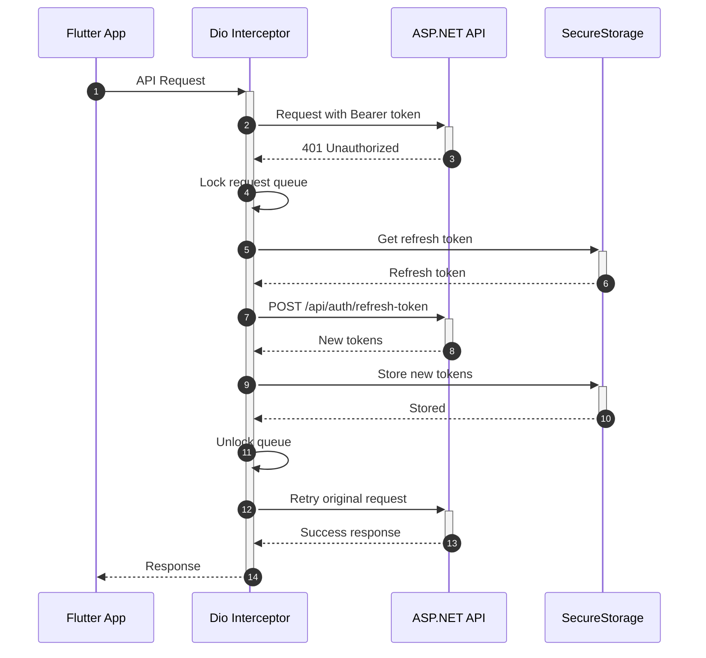
```mermaid
sequenceDiagram
    autonumber
    participant App as Flutter App
    participant Dio as Dio Interceptor
    participant API as ASP.NET API
    participant Storage as SecureStorage

    App->>+Dio: API Request
    Dio->>+API: Request with Bearer token
    API-->>-Dio: 401 Unauthorized

    Dio->>Dio: Lock request queue
    Dio->>+Storage: Get refresh token
    Storage-->>-Dio: Refresh token

    Dio->>+API: POST /api/auth/refresh-token
    API-->>-Dio: New tokens

    Dio->>+Storage: Store new tokens
    Storage-->>-Dio: Stored

    Dio->>Dio: Unlock queue
    Dio->>+API: Retry original request
    API-->>-Dio: Success response
    Dio-->>-App: Response
```

---

## 3. Subscription CRUD with Limit Check

### 3.1 Add Subscription (Free User Limit)

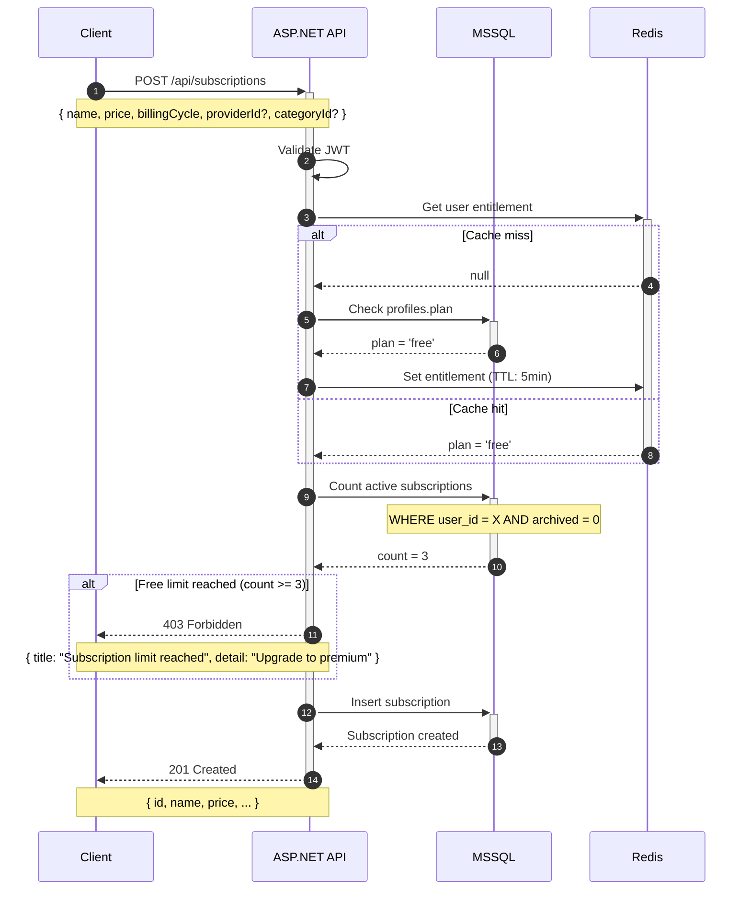
```mermaid
sequenceDiagram
    autonumber
    participant C as Client
    participant API as ASP.NET API
    participant DB as MSSQL
    participant Cache as Redis

    C->>+API: POST /api/subscriptions
    Note over C,API: { name, price, billingCycle, providerId?, categoryId? }

    API->>API: Validate JWT
    API->>+Cache: Get user entitlement

    alt Cache miss
        Cache-->>API: null
        API->>+DB: Check profiles.plan
        DB-->>-API: plan = 'free'
        API->>Cache: Set entitlement (TTL: 5min)
    else Cache hit
        Cache-->>-API: plan = 'free'
    end

    API->>+DB: Count active subscriptions
    Note over DB: WHERE user_id = X AND archived = 0
    DB-->>-API: count = 3

    alt Free limit reached (count >= 3)
        API-->>C: 403 Forbidden
        Note over C,API: { title: "Subscription limit reached", detail: "Upgrade to premium" }
    end

    API->>+DB: Insert subscription
    DB-->>-API: Subscription created

    API-->>-C: 201 Created
    Note over C,API: { id, name, price, ... }
```

### 3.2 Get Subscriptions with Category Resolution

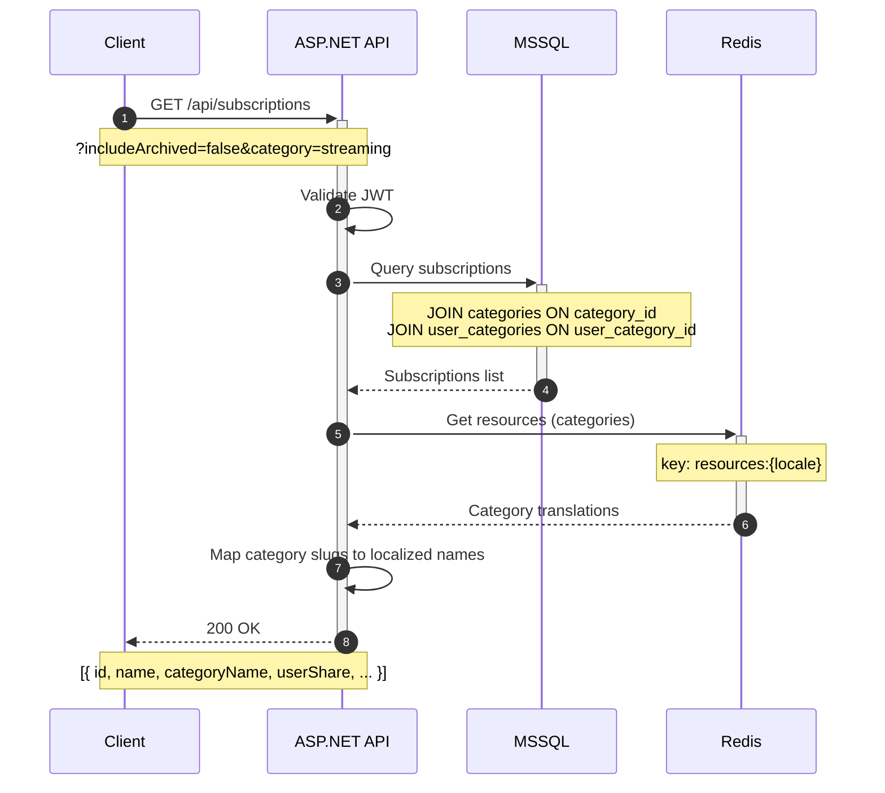
```mermaid
sequenceDiagram
    autonumber
    participant C as Client
    participant API as ASP.NET API
    participant DB as MSSQL
    participant Cache as Redis

    C->>+API: GET /api/subscriptions
    Note over C,API: ?includeArchived=false&category=streaming

    API->>API: Validate JWT

    API->>+DB: Query subscriptions
    Note over DB: JOIN categories ON category_id<br/>JOIN user_categories ON user_category_id
    DB-->>-API: Subscriptions list

    API->>+Cache: Get resources (categories)
    Note over Cache: key: resources:{locale}
    Cache-->>-API: Category translations

    API->>API: Map category slugs to localized names

    API-->>-C: 200 OK
    Note over C,API: [{ id, name, categoryName, userShare, ... }]
```

---

## 4. RevenueCat Payment Flow (Web)

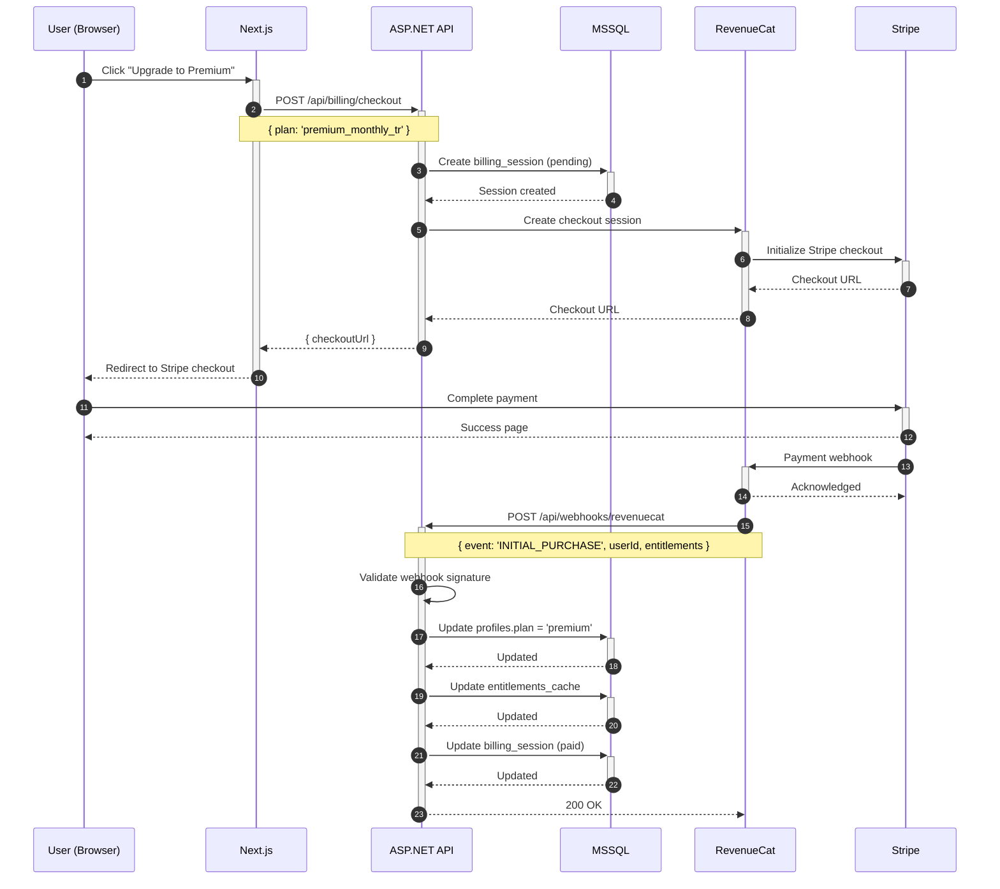
```mermaid
sequenceDiagram
    autonumber
    participant U as User (Browser)
    participant Web as Next.js
    participant API as ASP.NET API
    participant DB as MSSQL
    participant RC as RevenueCat
    participant Stripe as Stripe

    U->>+Web: Click "Upgrade to Premium"
    Web->>+API: POST /api/billing/checkout
    Note over Web,API: { plan: 'premium_monthly_tr' }

    API->>+DB: Create billing_session (pending)
    DB-->>-API: Session created

    API->>+RC: Create checkout session
    RC->>+Stripe: Initialize Stripe checkout
    Stripe-->>-RC: Checkout URL
    RC-->>-API: Checkout URL

    API-->>-Web: { checkoutUrl }
    Web-->>-U: Redirect to Stripe checkout

    U->>+Stripe: Complete payment
    Stripe-->>-U: Success page

    Stripe->>+RC: Payment webhook
    RC-->>-Stripe: Acknowledged

    RC->>+API: POST /api/webhooks/revenuecat
    Note over RC,API: { event: 'INITIAL_PURCHASE', userId, entitlements }

    API->>API: Validate webhook signature
    API->>+DB: Update profiles.plan = 'premium'
    DB-->>-API: Updated
    API->>+DB: Update entitlements_cache
    DB-->>-API: Updated
    API->>+DB: Update billing_session (paid)
    DB-->>-API: Updated

    API-->>-RC: 200 OK
```

---

## 5. RevenueCat Payment Flow (Mobile)

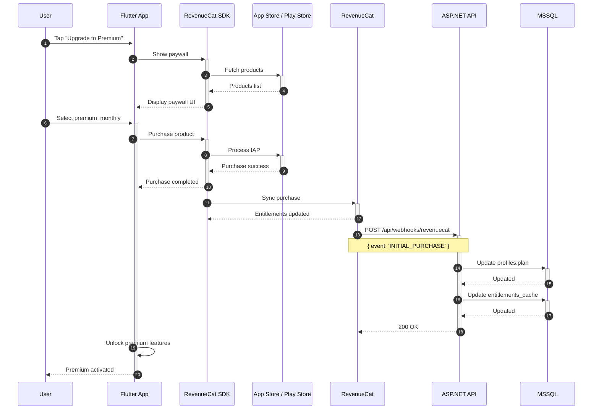
```mermaid
sequenceDiagram
    autonumber
    participant U as User
    participant App as Flutter App
    participant RC_SDK as RevenueCat SDK
    participant Store as App Store / Play Store
    participant RC as RevenueCat
    participant API as ASP.NET API
    participant DB as MSSQL

    U->>+App: Tap "Upgrade to Premium"
    App->>+RC_SDK: Show paywall
    RC_SDK->>+Store: Fetch products
    Store-->>-RC_SDK: Products list
    RC_SDK-->>-App: Display paywall UI

    U->>+App: Select premium_monthly
    App->>+RC_SDK: Purchase product
    RC_SDK->>+Store: Process IAP
    Store-->>-RC_SDK: Purchase success
    RC_SDK-->>-App: Purchase completed

    RC_SDK->>+RC: Sync purchase
    RC-->>-RC_SDK: Entitlements updated

    RC->>+API: POST /api/webhooks/revenuecat
    Note over RC,API: { event: 'INITIAL_PURCHASE' }

    API->>+DB: Update profiles.plan
    DB-->>-API: Updated
    API->>+DB: Update entitlements_cache
    DB-->>-API: Updated

    API-->>-RC: 200 OK

    App->>App: Unlock premium features
    App-->>-U: Premium activated
```

---

## 6. AI Suggestion Request

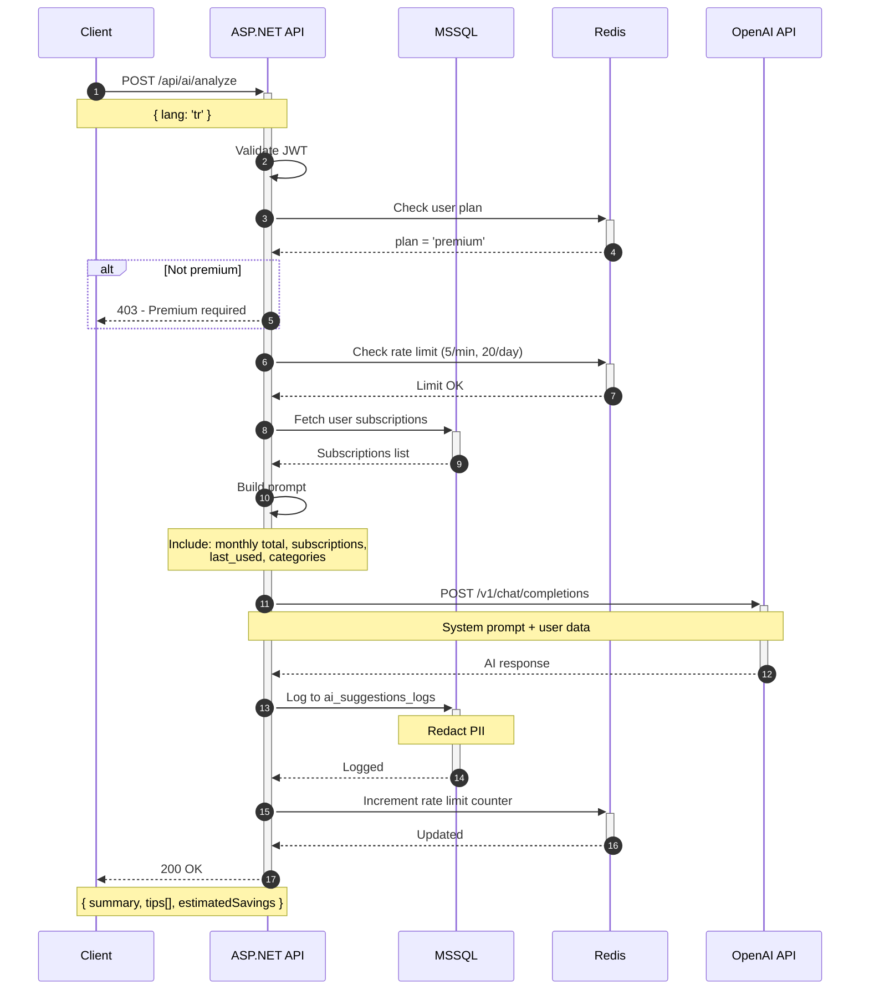
```mermaid
sequenceDiagram
    autonumber
    participant C as Client
    participant API as ASP.NET API
    participant DB as MSSQL
    participant Cache as Redis
    participant AI as OpenAI API

    C->>+API: POST /api/ai/analyze
    Note over C,API: { lang: 'tr' }

    API->>API: Validate JWT

    API->>+Cache: Check user plan
    Cache-->>-API: plan = 'premium'

    alt Not premium
        API-->>C: 403 - Premium required
    end

    API->>+Cache: Check rate limit (5/min, 20/day)
    Cache-->>-API: Limit OK

    API->>+DB: Fetch user subscriptions
    DB-->>-API: Subscriptions list

    API->>API: Build prompt
    Note over API: Include: monthly total, subscriptions,<br/>last_used, categories

    API->>+AI: POST /v1/chat/completions
    Note over API,AI: System prompt + user data
    AI-->>-API: AI response

    API->>+DB: Log to ai_suggestions_logs
    Note over DB: Redact PII
    DB-->>-API: Logged

    API->>+Cache: Increment rate limit counter
    Cache-->>-API: Updated

    API-->>-C: 200 OK
    Note over C,API: { summary, tips[], estimatedSavings }
```

---

## 7. Push Notification Registration

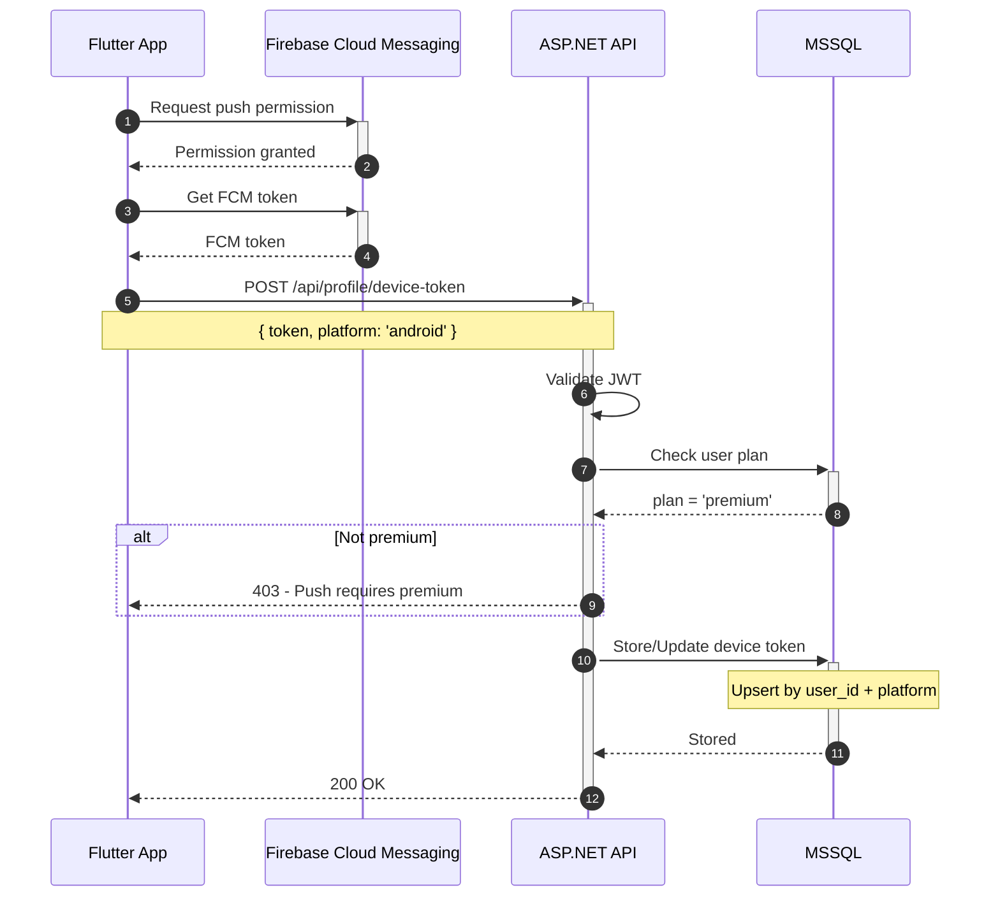
```mermaid
sequenceDiagram
    autonumber
    participant App as Flutter App
    participant FCM as Firebase Cloud Messaging
    participant API as ASP.NET API
    participant DB as MSSQL

    App->>+FCM: Request push permission
    FCM-->>-App: Permission granted

    App->>+FCM: Get FCM token
    FCM-->>-App: FCM token

    App->>+API: POST /api/profile/device-token
    Note over App,API: { token, platform: 'android' }

    API->>API: Validate JWT
    API->>+DB: Check user plan
    DB-->>-API: plan = 'premium'

    alt Not premium
        API-->>App: 403 - Push requires premium
    end

    API->>+DB: Store/Update device token
    Note over DB: Upsert by user_id + platform
    DB-->>-API: Stored

    API-->>-App: 200 OK
```

---

## 8. Renewal Reminder Flow

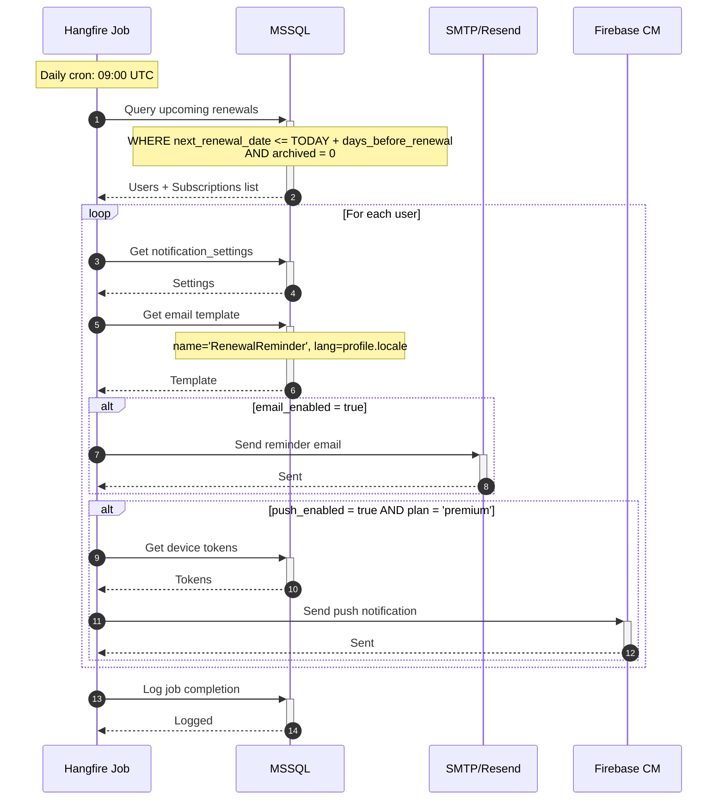
```mermaid
sequenceDiagram
    autonumber
    participant Job as Hangfire Job
    participant DB as MSSQL
    participant Email as SMTP/Resend
    participant FCM as Firebase CM

    Note over Job: Daily cron: 09:00 UTC

    Job->>+DB: Query upcoming renewals
    Note over DB: WHERE next_renewal_date <= TODAY + days_before_renewal<br/>AND archived = 0
    DB-->>-Job: Users + Subscriptions list

    loop For each user
        Job->>+DB: Get notification_settings
        DB-->>-Job: Settings

        Job->>+DB: Get email template
        Note over DB: name='RenewalReminder', lang=profile.locale
        DB-->>-Job: Template

        alt email_enabled = true
            Job->>+Email: Send reminder email
            Email-->>-Job: Sent
        end

        alt push_enabled = true AND plan = 'premium'
            Job->>+DB: Get device tokens
            DB-->>-Job: Tokens

            Job->>+FCM: Send push notification
            FCM-->>-Job: Sent
        end
    end

    Job->>+DB: Log job completion
    DB-->>-Job: Logged
```

---

## 9. Resource Localization Sync

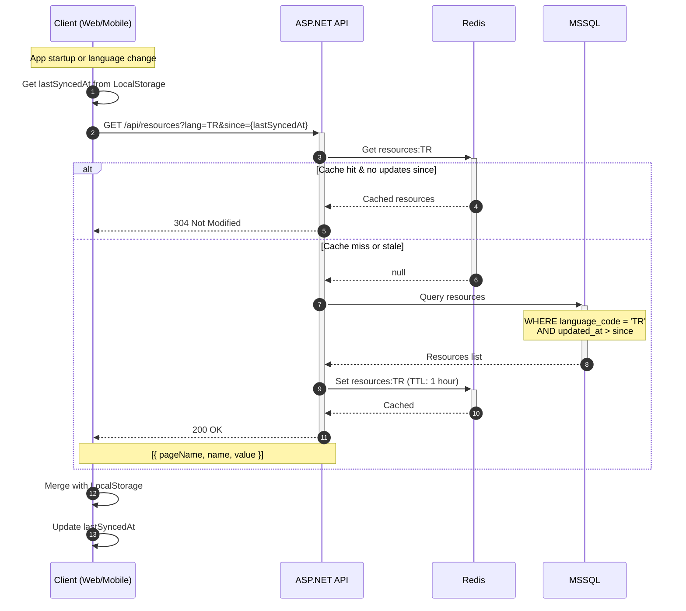
```mermaid
sequenceDiagram
    autonumber
    participant App as Client (Web/Mobile)
    participant API as ASP.NET API
    participant Cache as Redis
    participant DB as MSSQL

    Note over App: App startup or language change

    App->>App: Get lastSyncedAt from LocalStorage

    App->>+API: GET /api/resources?lang=TR&since={lastSyncedAt}

    API->>+Cache: Get resources:TR

    alt Cache hit & no updates since
        Cache-->>API: Cached resources
        API-->>App: 304 Not Modified
    else Cache miss or stale
        Cache-->>-API: null

        API->>+DB: Query resources
        Note over DB: WHERE language_code = 'TR'<br/>AND updated_at > since
        DB-->>-API: Resources list

        API->>+Cache: Set resources:TR (TTL: 1 hour)
        Cache-->>-API: Cached

        API-->>-App: 200 OK
        Note over App,API: [{ pageName, name, value }]
    end

    App->>App: Merge with LocalStorage
    App->>App: Update lastSyncedAt
```

---

## 10. Exchange Rate Sync

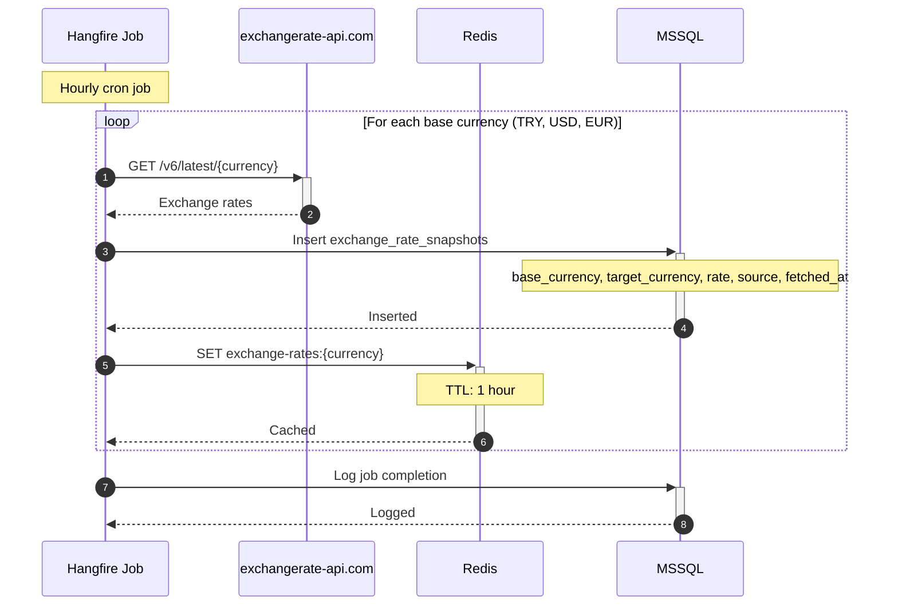
```mermaid
sequenceDiagram
    autonumber
    participant Job as Hangfire Job
    participant ExtAPI as exchangerate-api.com
    participant Cache as Redis
    participant DB as MSSQL

    Note over Job: Hourly cron job

    loop For each base currency (TRY, USD, EUR)
        Job->>+ExtAPI: GET /v6/latest/{currency}
        ExtAPI-->>-Job: Exchange rates

        Job->>+DB: Insert exchange_rate_snapshots
        Note over DB: base_currency, target_currency, rate, source, fetched_at
        DB-->>-Job: Inserted

        Job->>+Cache: SET exchange-rates:{currency}
        Note over Cache: TTL: 1 hour
        Cache-->>-Job: Cached
    end

    Job->>+DB: Log job completion
    DB-->>-Job: Logged
```

### Client Dashboard Calculation

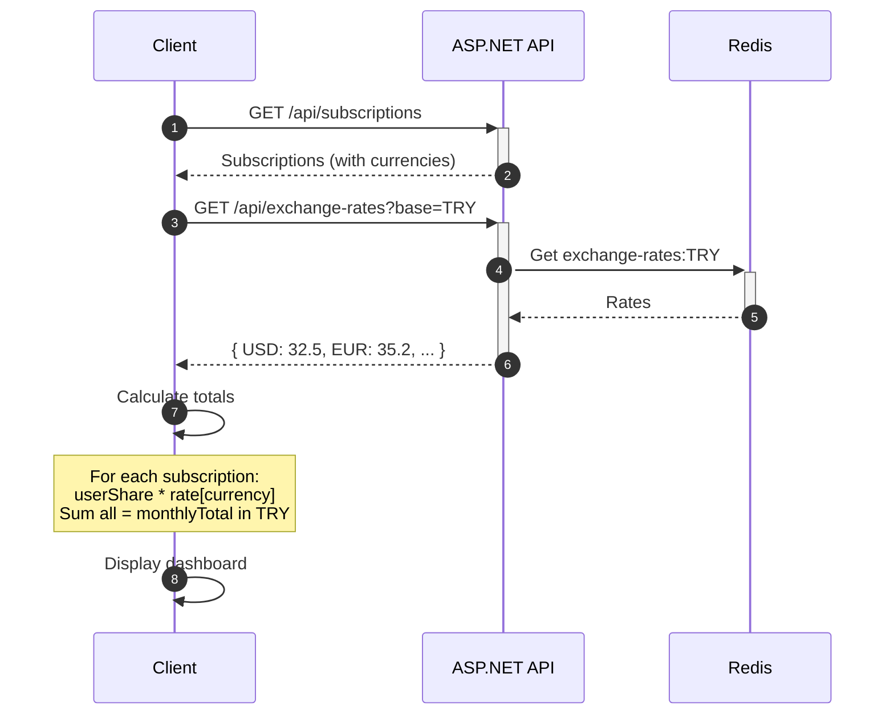
```mermaid
sequenceDiagram
    autonumber
    participant C as Client
    participant API as ASP.NET API
    participant Cache as Redis

    C->>+API: GET /api/subscriptions
    API-->>-C: Subscriptions (with currencies)

    C->>+API: GET /api/exchange-rates?base=TRY
    API->>+Cache: Get exchange-rates:TRY
    Cache-->>-API: Rates
    API-->>-C: { USD: 32.5, EUR: 35.2, ... }

    C->>C: Calculate totals
    Note over C: For each subscription:<br/>userShare * rate[currency]<br/>Sum all = monthlyTotal in TRY

    C->>C: Display dashboard
```

---

## 📊 Özet Tablo

| Akış              | Kritik Adımlar                     | Hata Durumları                      |
| ----------------- | ---------------------------------- | ----------------------------------- |
| Registration      | Email validation, Token generation | Duplicate email, Invalid input      |
| Login             | Password verify, Token issue       | Wrong password, Email not confirmed |
| Token Refresh     | Token rotation, Revocation         | Expired token, Already revoked      |
| Add Subscription  | Plan check, Limit enforce          | Free limit exceeded                 |
| Payment (Web)     | Checkout URL, Webhook              | Payment failed, Webhook timeout     |
| Payment (Mobile)  | IAP, Webhook sync                  | Store error, Webhook delay          |
| AI Suggestion     | Rate limit, OpenAI call            | Rate exceeded, AI error             |
| Push Registration | Plan check, FCM token              | Not premium                         |
| Renewal Reminder  | Cron job, Email/Push               | SMTP failure, FCM failure           |
| Resource Sync     | Delta sync, Cache                  | Cache miss fallback                 |
| Exchange Rate     | External API, Cache                | API failure, Stale cache            |
