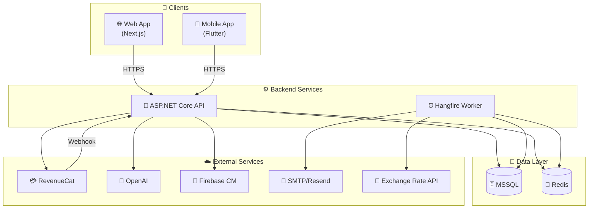
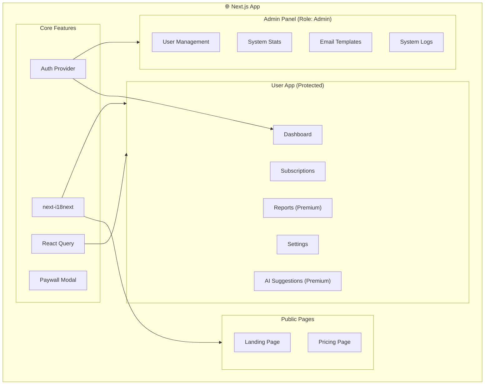
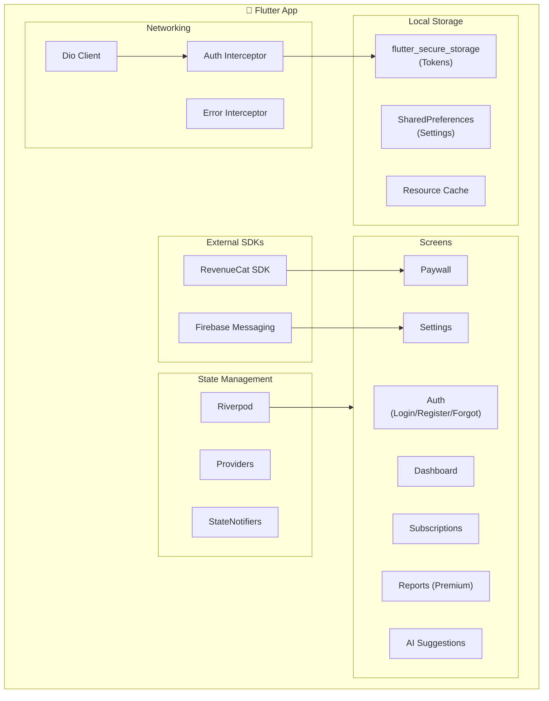
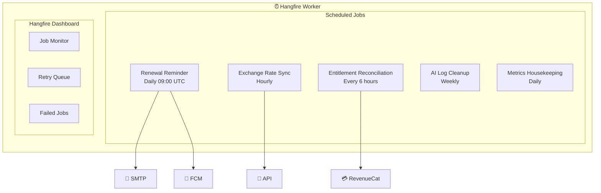
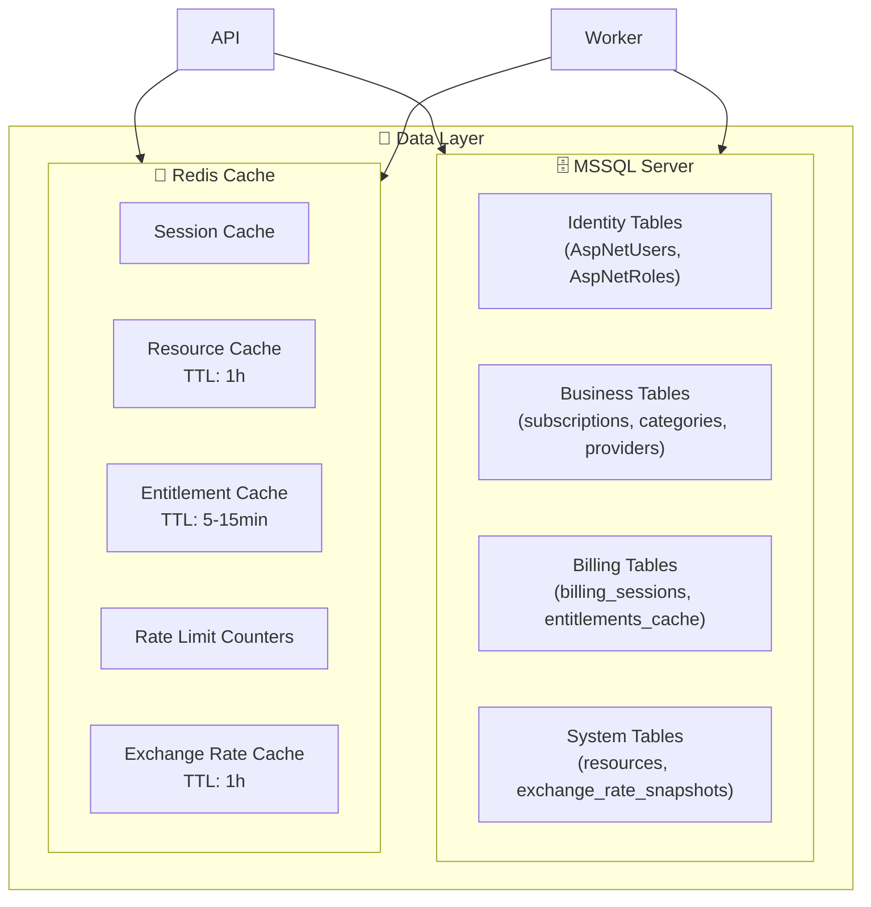
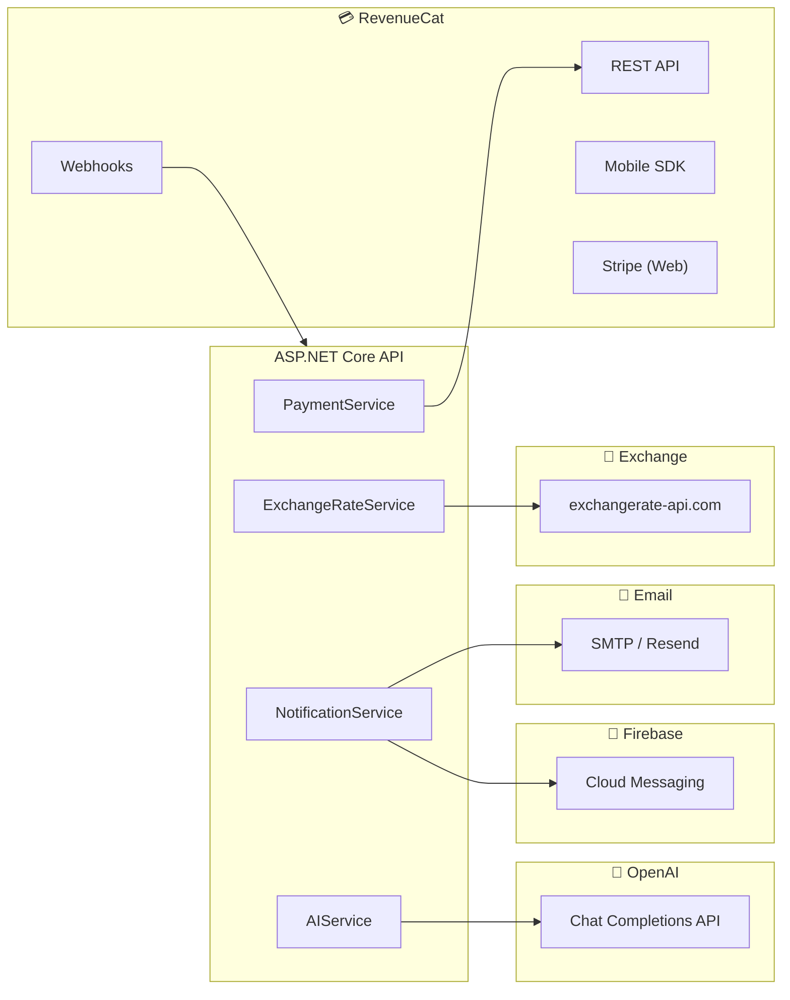
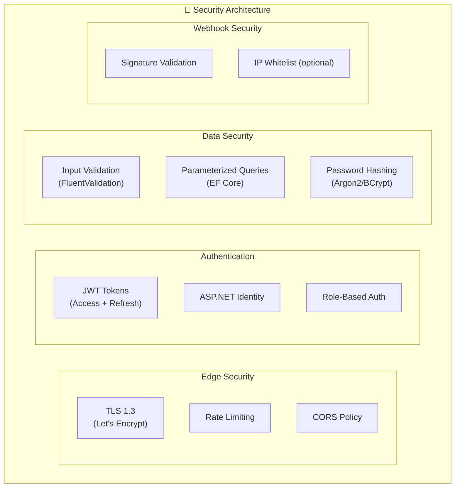
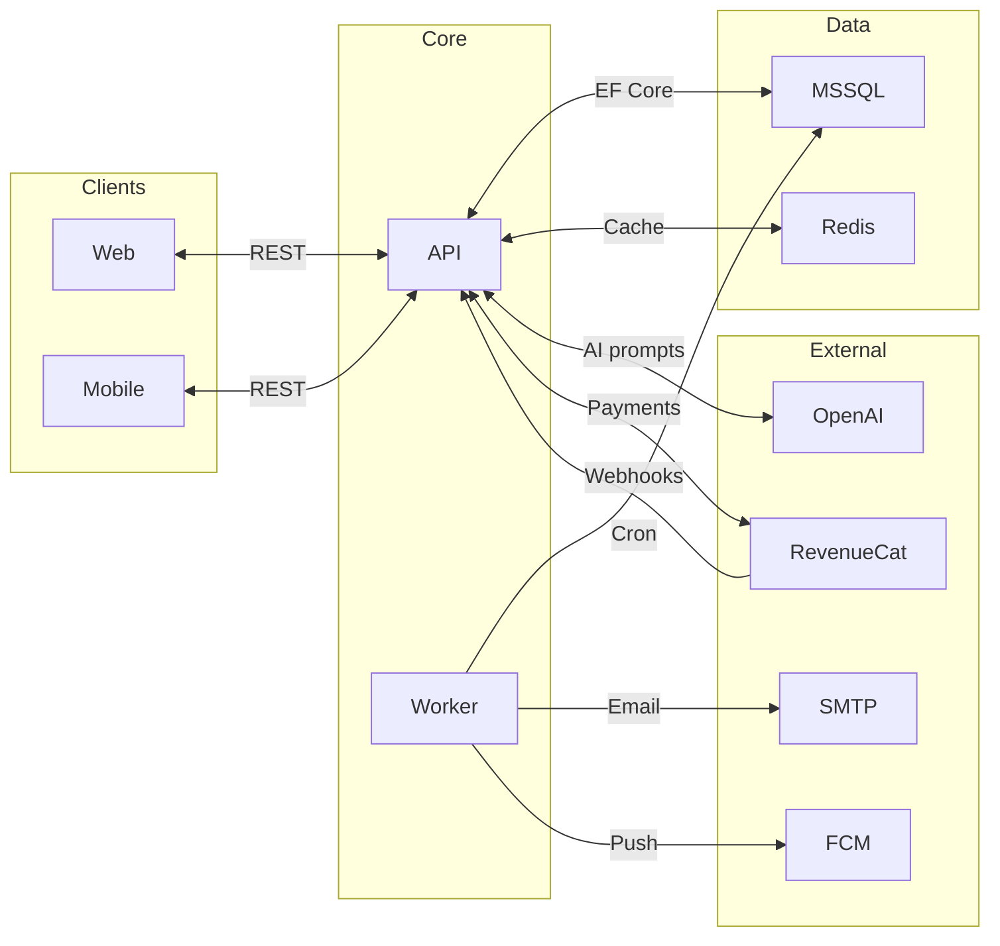

# Subify - Component Diagram

Bu doküman, Subify uygulamasının sistem bileşenlerini ve aralarındaki bağımlılıkları görselleştirir.

> **Referanslar:**
>
> - [Ana PRD](../Subify.Web.Uygulamasi.v2.PRD.md)
> - [Deployment Diagram](./DEPLOYMENT_DIAGRAM.md)

---

## 🏗️ Sistem Mimarisi Genel Bakış

---

## 📦 Bileşen Detayları

### 1. Web Frontend (Next.js)

**Tech Stack:**
| Bileşen | Teknoloji |
|---------|-----------|
| Framework | Next.js (App Router) |
| Language | TypeScript |
| State | React Query |
| i18n | next-i18next |
| Styling | Tailwind / Chakra UI |
| Auth | JWT (httpOnly cookie) |

---

### 2. Mobile App (Flutter)

**Tech Stack:**
| Bileşen | Teknoloji |
|---------|-----------|
| Framework | Flutter |
| Language | Dart |
| State | Riverpod (Code generation) |
| Navigation | GoRouter |
| HTTP | Dio |
| i18n | Flutter Intl (.arb) + DB resources |
| Secure Storage | flutter_secure_storage |
| IAP | RevenueCat (purchases_flutter) |
| Push | firebase_messaging |

---

### 3. Backend API (ASP.NET Core)

```mermaid
graph TB
    subgraph API["⚙️ ASP.NET Core 8 Web API"]
        subgraph Controllers["Controllers"]
            AuthCtrl["AuthController"]
            SubsCtrl["SubscriptionsController"]
            CatCtrl["CategoriesController"]
            ReportsCtrl["ReportsController"]
            AICtrl["AiController"]
            ProfileCtrl["ProfileController"]
            PaymentsCtrl["PaymentsController"]
            WebhookCtrl["WebhookController"]
            AdminCtrl["AdminController"]
            EmailTplCtrl["EmailTemplatesController"]
            ProvidersCtrl["ProvidersController"]
            ResourcesCtrl["ResourcesController"]
            ExchangeCtrl["ExchangeRatesController"]
            SystemCtrl["SystemController"]
        end

        subgraph Middleware["Middleware"]
            AuthMiddleware["JWT Authentication"]
            RateLimit["Rate Limiting"]
            CORS["CORS"]
            ErrorHandler["Global Error Handler<br/>(ProblemDetails)"]
        end

        subgraph Services["Services"]
            AuthService["AuthService"]
            SubscriptionService["SubscriptionService"]
            AIService["AIService"]
            PaymentService["PaymentService"]
            NotificationService["NotificationService"]
            CacheService["CacheService"]
            ResourceService["ResourceService"]
        end

        subgraph Infrastructure["Infrastructure"]
            EFCore["EF Core"]
            Identity["ASP.NET Identity"]
            Redis["IDistributedCache"]
            HttpClients["HttpClient Factory"]
        end
    end

    Controllers --> Services
    Services --> Infrastructure
    Middleware --> Controllers
```

**Controller Responsibility Matrix:**

| Controller               | Endpoints                       | Auth Required  | Roles                |
| ------------------------ | ------------------------------- | -------------- | -------------------- |
| AuthController           | /api/auth/\*                    | ❌ (public)    | -                    |
| SubscriptionsController  | /api/subscriptions/\*           | ✅             | User                 |
| CategoriesController     | /api/categories/\*              | ✅             | User                 |
| ReportsController        | /api/reports/\*                 | ✅             | User (Premium gated) |
| AiController             | /api/ai/\*                      | ✅             | User (Premium gated) |
| ProfileController        | /api/profile/\*                 | ✅             | User                 |
| PaymentsController       | /api/payments/_, /api/billing/_ | ✅             | User                 |
| WebhookController        | /api/webhooks/\*                | ❌ (signature) | -                    |
| AdminController          | /api/admin/\*                   | ✅             | Admin                |
| EmailTemplatesController | /api/email-templates/\*         | ✅             | Admin                |
| ProvidersController      | /api/providers/\*               | ✅             | User                 |
| ResourcesController      | /api/resources/\*               | ❌ (public)    | -                    |
| ExchangeRatesController  | /api/exchange-rates/\*          | ❌ (public)    | -                    |
| SystemController         | /api/system/\*                  | ❌ (public)    | -                    |

---

### 4. Background Worker (Hangfire)

**Job Schedule:**

| Job                          | Schedule                  | Description                              |
| ---------------------------- | ------------------------- | ---------------------------------------- |
| RenewalReminderJob           | `0 9 * * *` (Daily 09:00) | Check upcoming renewals, send email/push |
| ExchangeRateSyncJob          | `0 * * * *` (Hourly)      | Fetch rates from exchangerate-api.com    |
| EntitlementReconciliationJob | `0 */6 * * *` (Every 6h)  | Sync with RevenueCat for consistency     |
| AILogCleanupJob              | `0 3 * * 0` (Weekly)      | Archive old AI suggestion logs           |
| MetricsHousekeepingJob       | `0 4 * * *` (Daily 04:00) | Aggregate and archive metrics            |

---

### 5. Data Layer

---

### 6. External Services Integration

**Integration Details:**

| Service              | Purpose                 | Auth Method     | Rate Limit     |
| -------------------- | ----------------------- | --------------- | -------------- |
| RevenueCat           | Subscription management | API Key         | Per plan       |
| OpenAI               | AI suggestions          | API Key         | Token-based    |
| Firebase CM          | Push notifications      | Service Account | 500k/day free  |
| SMTP/Resend          | Email notifications     | API Key         | Per plan       |
| exchangerate-api.com | Currency rates          | API Key         | 250/month free |

---

## 🔐 Security Layers

---

## 📊 Dependency Matrix

| Component      | Depends On                            | Depended By         |
| -------------- | ------------------------------------- | ------------------- |
| **Web App**    | API, RevenueCat (checkout URL)        | -                   |
| **Mobile App** | API, RevenueCat SDK, FCM              | -                   |
| **API**        | MSSQL, Redis, OpenAI, RevenueCat, FCM | Web, Mobile, Worker |
| **Worker**     | MSSQL, Redis, SMTP, Exchange API      | -                   |
| **MSSQL**      | -                                     | API, Worker         |
| **Redis**      | -                                     | API, Worker         |

---

## 🔄 Data Flow Summary

