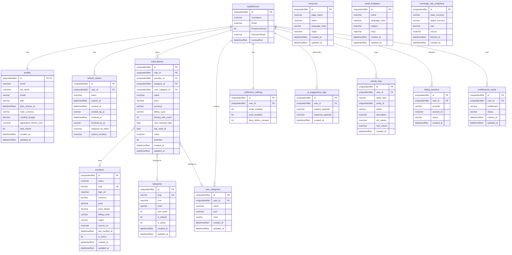
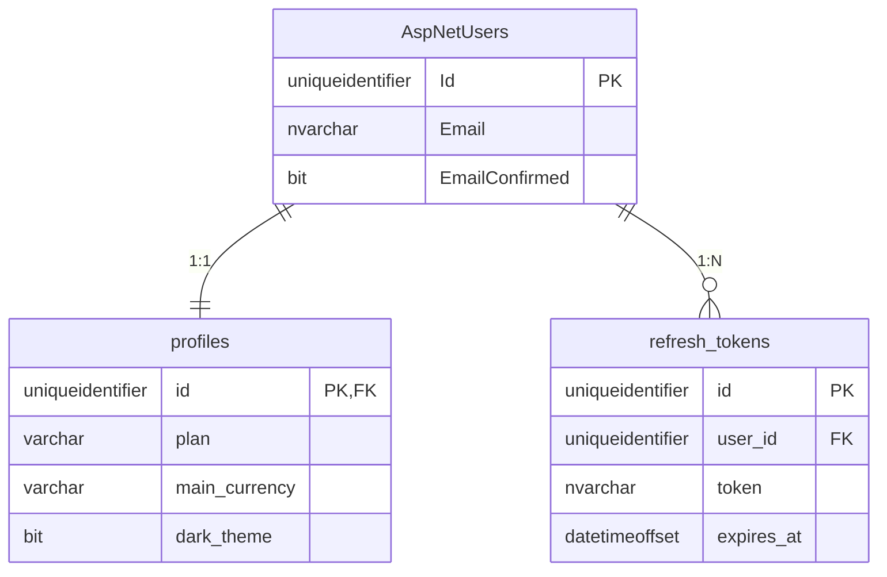
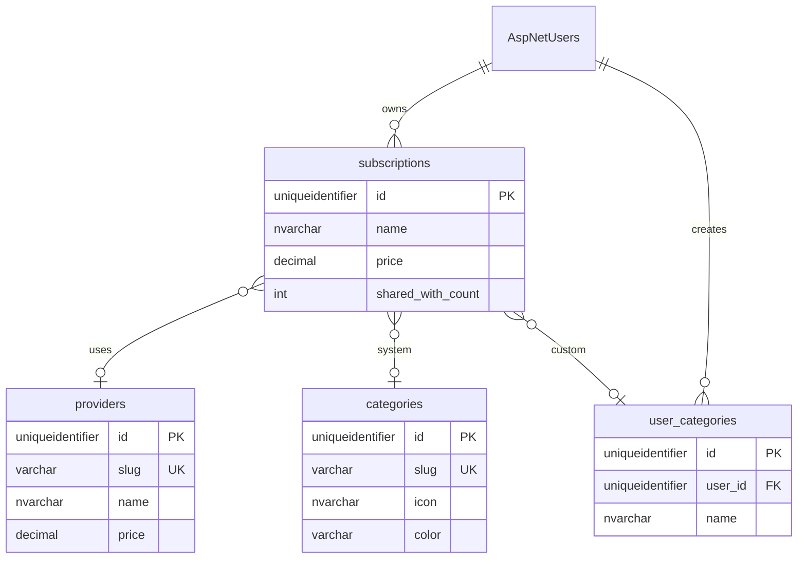
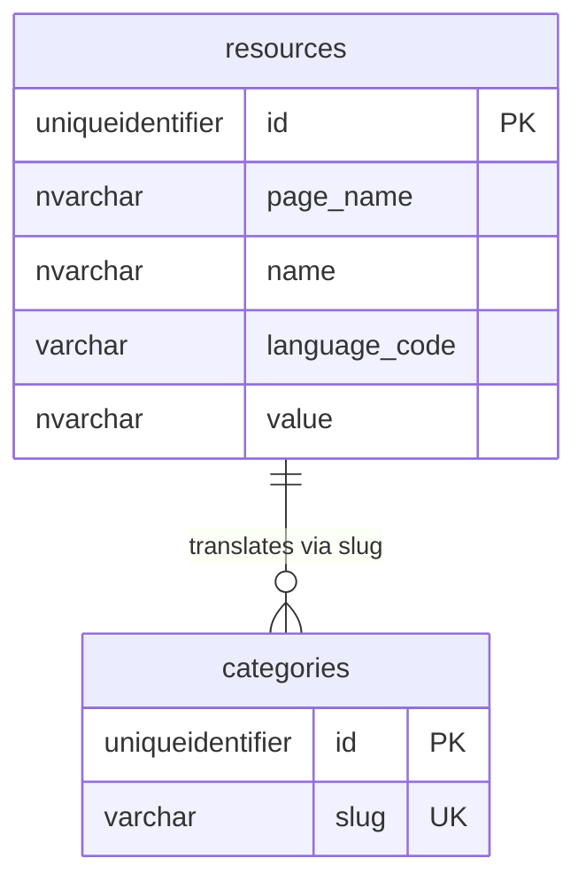
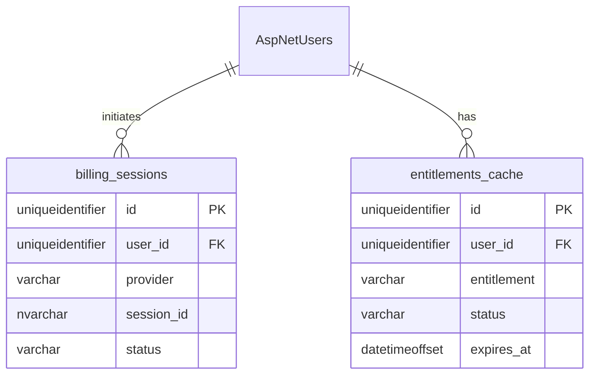

# Subify - Entity Relationship Diagram (ERD)

Bu doküman, Subify uygulamasının veritabanı şemasını Mermaid formatında görselleştirir.

> **Referanslar:**
>
> - [Detaylı Veri Modeli](../DATA_MODEL.md)
> - [ADR Kararları](../ADR.md)

---

## 📊 Tam ERD Diyagramı

---

## 🔗 İlişki Açıklamaları

### 1:1 İlişkiler

| Kaynak        | Hedef                   | Açıklama                               |
| ------------- | ----------------------- | -------------------------------------- |
| `AspNetUsers` | `profiles`              | Her kullanıcının bir profili var       |
| `AspNetUsers` | `notification_settings` | Her kullanıcının bildirim ayarları var |

### 1:N İlişkiler

| Kaynak        | Hedef                 | Açıklama                                         |
| ------------- | --------------------- | ------------------------------------------------ |
| `AspNetUsers` | `refresh_tokens`      | Kullanıcının birden fazla token'ı olabilir       |
| `AspNetUsers` | `subscriptions`       | Kullanıcı birden fazla abonelik ekleyebilir      |
| `AspNetUsers` | `user_categories`     | Kullanıcı özel kategoriler oluşturabilir         |
| `AspNetUsers` | `ai_suggestions_logs` | Kullanıcı birden fazla AI önerisi alabilir       |
| `AspNetUsers` | `activity_logs`       | Kullanıcı aktiviteleri loglanır                  |
| `AspNetUsers` | `billing_sessions`    | Kullanıcı birden fazla ödeme girişimi yapabilir  |
| `AspNetUsers` | `entitlements_cache`  | Kullanıcının birden fazla entitlement'ı olabilir |

### N:1 İlişkiler (Optional)

| Kaynak          | Hedef             | Açıklama                                            |
| --------------- | ----------------- | --------------------------------------------------- |
| `subscriptions` | `providers`       | Abonelik bir sağlayıcıya bağlı olabilir (opsiyonel) |
| `subscriptions` | `categories`      | Abonelik sistem kategorisine bağlı olabilir         |
| `subscriptions` | `user_categories` | Abonelik kullanıcı kategorisine bağlı olabilir      |

---

## 📋 Modül Bazlı ERD

### Identity & Auth Modülü

---

### Core Business Modülü

---

### Localization Modülü

> [!NOTE] > `categories.slug` değeri `resources` tablosunda `PageName='Category', Name=slug` şeklinde lookup yapılır.

---

### Billing & Entitlements Modülü

---

## 🗃️ Index Stratejisi

| Tablo                     | Index                                               | Tip       | Açıklama              |
| ------------------------- | --------------------------------------------------- | --------- | --------------------- |
| `subscriptions`           | `(user_id, archived, next_renewal_date)`            | Composite | Dashboard sorguları   |
| `profiles`                | `(plan)`                                            | Single    | Plan bazlı filtreleme |
| `refresh_tokens`          | `(user_id, token)`                                  | Composite | Token validation      |
| `entitlements_cache`      | `(user_id, entitlement)`                            | Composite | Entitlement check     |
| `email_templates`         | `(name, language_code)`                             | Unique    | Template lookup       |
| `categories`              | `(slug)`                                            | Unique    | Slug bazlı lookup     |
| `providers`               | `(slug)`                                            | Unique    | Slug bazlı lookup     |
| `resources`               | `(page_name, name, language_code)`                  | Unique    | Localization lookup   |
| `exchange_rate_snapshots` | `(base_currency, target_currency, fetched_at DESC)` | Composite | Latest rate query     |
| `activity_logs`           | `(user_id, created_at DESC)`                        | Composite | Dashboard sorguları   |
